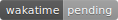

本项目为视频代码或直播课程代码，希望大家能给个 `star` 这是对我们最好的鼓励和肯定。

Github 仓库：https://github.com/houdunwang/coding

Gitee 仓库：https://gitee.com/houdunren/code

## 八点直播

我们会在每天晚上八点直播（注：特殊情况会请假），非常感谢大家的光临。

| 平台 | 地址                                                                   |
| ---- | ---------------------------------------------------------------------- |
| B 站 | [https://live.bilibili.com/8515468](https://live.bilibili.com/8515468) |
| 斗鱼 | [https://www.douyu.com/4179871](https://www.douyu.com/4179871)         |
| 腾讯 | [https://ke.qq.com/course/288236](https://ke.qq.com/course/288236)     |
| 抖音 | 抖音号: 268943416                                                      |

## 目录说明

| 目录     | 说明                                                               |
| -------- | ------------------------------------------------------------------ |
| live     | 晚八点直播代码                                                     |
| video    | 视频代码                                                           |
| material | 图片、模板等素材                                                   |
| docs     | 文档，最新文档请访问 [doc.houdunren.com](http://doc.houdunren.com) |
| archives | 按年份归档的代码，每年一个归档                                     |

## 编码时间

下面是最近七天向军大叔编码时间

