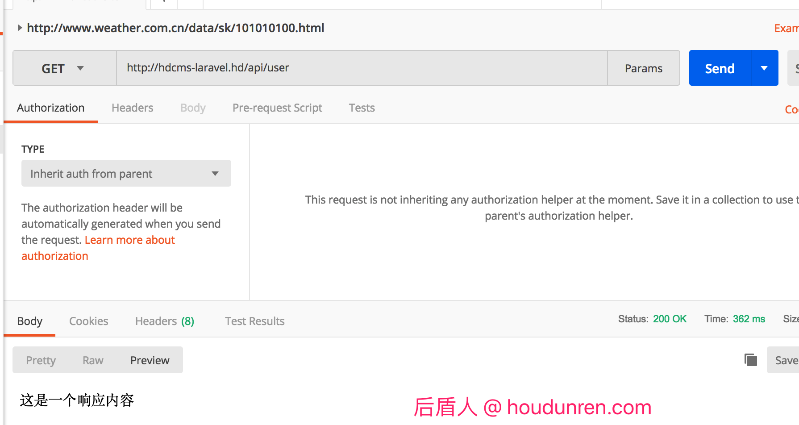
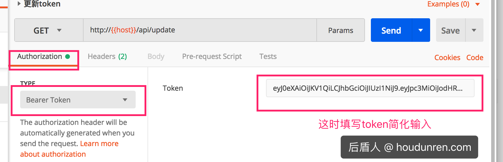

## Api

> 后盾人 houdunren.com @ 向军大叔

REST是所有Web应用都应该遵守的架构设计指导原则。  Representational State Transfer，翻译是”表现层状态转化”。  

面向资源是REST最明显的特征，对于同一个资源的一组不同的操作。资源是服务器上一个可命名的抽象概念，资源是以名词为核心来组织的，首先关注的是名词。REST要求，必须通过统一的接口来对资源执行各种操作。对于每个资源只能执行一组有限的操作。

### 动作

```
GET （SELECT）：从服务器检索特定资源，或资源列表
POST （CREATE）：在服务器上创建一个新的资源
PUT （UPDATE）：更新服务器上的资源，提供整个资源
PATCH （UPDATE）：更新服务器上的资源，仅提供更改的属性
DELETE （DELETE）：从服务器删除资源
```

### 命名

路径又称"终点"（endpoint），表示API的具体网址。

在RESTful架构中，每个网址代表一种资源（resource），所以网址中不能有动词，只能有名词，而且所用的名词往往与数据库的表名对应。一般来说，数据库中的表都是同种记录的"集合"（collection），所以API中的名词也应该使用复数。

举例来说，有一个API提供动物园（zoo）的信息，还包括各种动物和雇员的信息，则它的路径应该设计成下面这样。

接口尽量使用名词，禁止使用动词，下面是一些例子。

```
GET         /zoos：列出所有动物园
POST        /zoos：新建一个动物园
GET         /zoos/ID：获取某个指定动物园的信息
PUT         /zoos/ID：更新某个指定动物园的信息（提供该动物园的全部信息）
PATCH       /zoos/ID：更新某个指定动物园的信息（提供该动物园的部分信息）
DELETE      /zoos/ID：删除某个动物园
GET         /zoos/ID/animals：列出某个指定动物园的所有动物
DELETE      /zoos/ID/animals/ID：删除某个指定动物园的指定动物
```

再比如，某个URI是/posts/show/1，其中show是动词，这个URI就设计错了，正确的写法应该是/posts/1，然后用GET方法表示show。

### 版本

应该将API的版本号放入URL。如：

```
https://api.example.com/v1
```

### 过滤

如果记录数量很多，服务器不可能都将它们返回给用户。API应该提供参数，过滤返回结果。
下面是一些常见的参数。

```
?limit=10：指定返回记录的数量
?offset=10：指定返回记录的开始位置。
?page_number=2&page_size=100：指定第几页，以及每页的记录数。
?sortby=name&order=asc：指定返回结果按照哪个属性排序，以及排序顺序。
?animal_type_id=1：指定筛选条件
```

### 状态码

```
200 OK - [GET]：服务器成功返回用户请求的数据，该操作是幂等的（Idempotent）。
201 CREATED - [POST/PUT/PATCH]：用户新建或修改数据成功。
202 Accepted - [*]：表示一个请求已经进入后台排队（异步任务）
204 NO CONTENT - [DELETE]：用户删除数据成功。
400 INVALID REQUEST - [POST/PUT/PATCH]：用户发出的请求有错误，服务器没有进行新建或修改数据的操作
401 Unauthorized - [*]：表示用户没有权限（令牌、用户名、密码错误）。
403 Forbidden - [*] 表示用户得到授权（与401错误相对），但是访问是被禁止的。
404 NOT FOUND - [*]：用户发出的请求针对的是不存在的记录，服务器没有进行操作，该操作是幂等的。
406 Not Acceptable - [GET]：用户请求的格式不可得（比如用户请求JSON格式，但是只有XML格式）。
410 Gone -[GET]：用户请求的资源被永久删除，且不会再得到的。
422 Unprocesable entity - [POST/PUT/PATCH] 当创建一个对象时，发生一个验证错误。
429 Too Many Requests - 由于请求频次达到上限而被拒绝访问
500 INTERNAL SERVER ERROR - [*]：服务器发生错误，用户将无法判断发出的请求是否成功。
```

### 响应格式

从可读性和通用性来讲 `JSON` 是最好的响应数据格式，下面是一个错误消息响应数据结构。

```
{   
	'message' => ':message',
	'errors' => ':errors',
	'code' => ':code',
	'status_code' => ':status_code',
	'debug' => ':debug'
}
```

- message：表示在API调用失败的情况下详细的错误信息，这个信息可以由客户端直接呈现给用户
- errors：参数具体错误，比如字段较对错误内容
- code：自定义错误码
- status_code：http状态码
- debug：debug调试信息

> 错误返回值根据情况进行删减

## Postman

postman可以高效的测试和维护接口。https://www.getpostman.com/apps


使用 `postMan` 工具测试结果



### 环境变量

我们在本地和服务器上都想测试接口，可以将域名定义为环境变量，这样我们只要改变环境域名就会自动变化。


## Dingo

Dingo Api 是致力于提供给开发者一套工具，帮助你方便快捷的建造你自己的API。这个包的目标是保持尽可能的灵活，它并不能覆盖所有的情况，也不能解决所有的问题。 

官网：https://github.com/dingo/api/ 

文档：https://github.com/dingo/api/wiki/Configuration

### 安装组件

```
composer require dingo/api:2.0.0-alpha2
```

执行下面命令生成配置文件 `/config/api.php`

```
php artisan vendor:publish
```

### 配置说明

配置统一定义在 `config/api.php` 文档中

```
#接口围绕：[x]本地和私有环境 [prs]公司内部app使用 [vnd]公开接口
'standardsTree' => env('API_STANDARDS_TREE', 'x')

#项目名称
'subtype' => env('API_SUBTYPE', 'hdcms')

#Api前缀 通过 www.hdcms.com/api 来访问 API。
'prefix' => env('API_PREFIX', 'api')

#api域名
'domain' => env('API_DOMAIN', 'api.hdcms.com'),

#版本号
'version' => env('API_VERSION', 'v1')

#开发时开启DEBUG便于发现错误
'debug' => env('API_DEBUG', false)
```

> prefix 与 domain 只能二选一

### 接口版本

在 `routes/api.php` 文件定义

```
$api = app(\Dingo\Api\Routing\Router::class);

#默认配置指定的是v1版本，可以直接通过 {host}/api/version 访问到
$api->version('v1', function ($api) {
    $api->get('version', function () {
        return 'v1';
    });
});

#如果v2不是默认版本，需要设置请求头  
#Accept: application/[配置项 standardsTree].[配置项 subtype].v2+json
$api->version('v2', function ($api) {
    $api->get('version', function () {
        return 'v2';
    });
});
```

### 基础控制器

```
php artisan make:controller Api/Controller
```

修改内容如下

```
namespace App\Http\Controllers\Api;

use Dingo\Api\Routing\Helpers;
use Illuminate\Http\Request;
use App\Http\Controllers\Controller as SysController;

class Controller extends SysController
{
    use Helpers;
}
```

### Transformers

Transformers 允许你便捷地、始终如一地将对象转换为一个数组。通过使用一个 transformer 你可以对整数和布尔值，包括分页结果和嵌套关系进行类型转换。

#### 基本使用

一个 **transformer** 是一个类，它会获取原始数据并将返回一个格式化之后的标准数组。

```
namespace App\Transformers;

use App\User;
use League\Fractal\TransformerAbstract;

class UserTransformer extends TransformerAbstract
{
    public function transform(User $user)
    {
        return [
            'id'   		=> $user['id'],
            'name' 		=> $user['name'],
            'created_at'=> $user->created_at->toDateTimeString()
        ];
    }
}
```

**返回单个数据**

```
return $this->response->item(User::find(1),new UserTransformer());
```

**返回集合**

```
return $this->response->collection(User::get(),new UserTransformer());
```

**分页数据**

```
return $this->response->paginator(User::paginate(2),new UserTransformer());
```

#### include

获取文章时我们希望获取文章的栏目数据，include的特性就非常方便了。

下面是ContentTransformer中的定义，

```
class ContentTransformer extends TransformerAbstract
{
	# 定义可以include可使用的字段
    protected $availableIncludes = ['category'];

    public function transform(Content $content)
    {
        return [
            'id'   => $content['id'],
            'name' => $content['title'],
        ];
    }

    public function includeCategory(Content $content)
    {
        return $this->item($content->category,new CategoryTransformer());
    }
}
```

当我们调用 `{host}/api/contents?include=category` 接口时，栏目数据也一并会返回

```
return $this->response->paginator(Content::paginate(1),new ContentTransformer());
```

返回结果如下

```
{
    "data": [
        {
            "id": 1,
            "name": "后盾人 人人做后盾",
            "category": {
                "data": {
                    "id": 2,
                    "name": "编程"
                }
            }
        }
    ],
    "meta": {
        "pagination": {
            "total": 100,
            "count": 1,
            "per_page": 1,
            "current_page": 1,
            "total_pages": 100,
            "links": {
                "next": "http://xiang.houdunren.com/api/contents?page=2"
            }
        }
    }
}
```

### 响应结果

**设置响应状态码**

```
return $this->response->array(User::get())->setStatusCode(200);
```

```
return response()->json(['error' => 'Unauthorized'], 401);
```

**错误响应**

```
// 一个自定义消息和状态码的普通错误。
return $this->response->error('This is an error.', 404);

// 一个没有找到资源的错误，第一个参数可以传递自定义消息。
return $this->response->errorNotFound();

// 一个 bad request 错误，第一个参数可以传递自定义消息。
return $this->response->errorBadRequest();

// 一个服务器拒绝错误，第一个参数可以传递自定义消息。
return $this->response->errorForbidden();

// 一个内部错误，第一个参数可以传递自定义消息。
return $this->response->errorInternal();

// 一个未认证错误，第一个参数可以传递自定义消息。
return $this->response->errorUnauthorized('帐号或密码错误');
```

### 限制请求数

使用 `api.throttle`中间件结合 `limit、expires` 参数可实现接口次数限制。下面是定义在 `routes/api.php` 路由文件中的示例。

```
$api->version('v1', ['namespace' => '\App\Api'], function ($api) {
    $api->group(['middleware' => 'api.throttle', 'limit' => 2, 'expires' => 1], function ($api) {
        $api->get('user', 'UserController@all');
    });
});
```

限制1分钟只能访问2次。

### 身份验证

可以通过 `api.auth` 路由中间件来启用路由或者路由群组的保护，我们使用下面讲解的jwt组件完成接口验证。

**在所有的路由上启用**

```
$api->version('v1', ['middleware' => 'api.auth'], function ($api) {
    // 在这个版本群组下的所有路由将进行身份验证。
});
```

**特定的路由上启用**

```
$api->version('v1', function ($api) {
    $api->get('user', ['middleware' => 'api.auth', function () {
        // 这个路由将进行身份验证。
    }]);

    $api->get('posts', function () {
        // 这个路由不会验证身份。
    });
});
```

 **控制器上进行身份验证**

`Laravel`可以在控制器里启用中间件。您可以在构造函数里使用 `middleware` 的方法。

```
class UserController extends Illuminate\Routing\Controller
{
    use Helpers;

    public function __construct()
    {
        $this->middleware('api.auth');

        // 这个中间件只在  index  中启用
        $this->middleware('api.auth', ['only' => ['index']]);
    }
...
```

## Jwt

Jwt是高效简单的接口验证组件，使用非常广泛。

GitHub：https://github.com/tymondesigns/jwt-auth   

Packagist：https://packagist.org/packages/tymon/jwt-auth

在线文档： http://jwt-auth.readthedocs.io/en/develop/quick-start/

### 安装组件

目前2.0版本正在开发中还不可以正常使用，所以我们使用 1.0.0-rc.2。

```
composer require tymon/jwt-auth:1.0.0-rc.2
```

**生成配置文件**

```
php artisan vendor:publish
```

**生成密钥**

这是用来给你的token签名的钥匙，使用以下命令生成一个密钥:

```
php artisan jwt:secret
```

这将用 `JWT_SECRET=foobar` 更新.env文件

### 配置说明

JWT配置文件是 `config/jwt.php`，下面有部分配置项进行说明：

```
#令牌过期时间(单位分钟)，设置null为永不过期
'ttl' => env('JWT_TTL', 60)

#刷新令牌时间(单位分钟)，设置为null可永久随时刷新
'refresh_ttl' => env('JWT_REFRESH_TTL', 20160)
```

### 更新用户模型

首先，您需要在用户模型上实现 `Tymon\JWTAuth\Contracts\JWTSubject` 契约，它要求您实现两个方法 `getJWTIdentifier()` 和 `getJWTCustomClaims()`。

下面的示例应该能让您了解这可能是什么样子的。显然，您应该根据需要进行任何更改，以满足自己的需要。

```
<?php

namespace App;

use Tymon\JWTAuth\Contracts\JWTSubject;
use Illuminate\Notifications\Notifiable;
use Illuminate\Foundation\Auth\User as Authenticatable;

class User extends Authenticatable implements JWTSubject
{
    use Notifiable;

    /**
     * 获取将存储在JWT主题声明中的标识符.
     * 就是用户表主键 id
     *
     * @return mixed
     */
    public function getJWTIdentifier()
    {
        return $this->getKey();
    }

    /**
     * 返回一个键值数组，其中包含要添加到JWT的任何自定义声明.
     *
     * @return array
     */
    public function getJWTCustomClaims()
    {
        return [];
    }
}
```

### 配置验证守卫

修改 `config/auth.php` 文件以使用jwt保护来为接口身份验证提供支持。

```
'guards' => [
	'web' => [
		'driver' => 'session',
		'provider' => 'users',
	],
	'api' => [
		'driver' => 'jwt',
		'provider' => 'users',
	],
]
```

修改dingo配置文件 `config/api.php` 文件中的身份验证提供者

```
'auth' => [
	'jwt' => \Dingo\Api\Auth\Provider\JWT::class,
],
```

### 验证操作

**路由定义**

```
$api = app(\Dingo\Api\Routing\Router::class);
$api->version('v1', ['namespace' => 'App\Http\Controllers\Api',], function ($api) {
    $api->post('login', 'AuthController@login');
    $api->get('logout', 'AuthController@logout');
    $api->get('me', 'AuthController@me');
});
```

**控制器定义**

```
class AuthController extends Controller
{
    public function __construct()
    {
    	// 除login外都需要验证
        $this->middleware('auth:api', ['except' => ['login']]);
    }

    //登录获取token
    public function login()
    {
        $credentials = request(['email', 'password']);

        if (!$token = auth('api')->attempt($credentials)) {
			return $this->response->errorUnauthorized('帐号或密码错误');
        }

        return $this->respondWithToken($token);
    }

    //获取用户资料
    public function me()
    {
        return response()->json(auth('api')->user());
    }

    //销毁token
    public function logout()
    {
        auth('api')->logout();

        return response()->json(['message' => 'Successfully logged out']);
    }

    //刷新token
    public function refresh()
    {
        return $this->respondWithToken(auth('api')->refresh());
    }

    //响应token
    protected function respondWithToken($token)
    {
        return response()->json([
            'access_token' => $token,
            'token_type'   => 'bearer',
            'expires_in'   => auth('api')->factory()->getTTL() * 60,
        ]);
    }
}
```

### 使用令牌

当请求需要验证的api时必须带有token，下面是使用header头携带令牌数据

```
Authorization: Bearer 令牌数据
```

在postman 工具中可以使用以下方式简化操作


