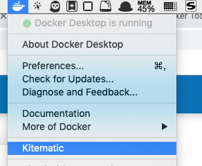

# docker for mac

> 后盾人 @ 版权所有 ，请尊重他人劳动成果，转载请注明出处 houdunren.com。
>
> 感谢你的支持与理解。


## 安装

**Docker Desktop for Mac**

下载地址： https://hub.docker.com/?overlay=onboarding

**Docker Toolbox**

点击下图链接，在弹出的窗口中点击下载即可。



Docker Toolbox包括以下Docker工具：

- Docker CLI客户端，用于运行Docker Engine以创建映像和容器
- Docker Machine，因此您可以从Windows终端运行Docker Engine命令
- Docker Compose用于运行`docker-compose`命令
- Kitematic，Docker GUI
- 为Docker命令行环境预配置的Docker QuickStart shell
- Oracle VM VirtualBox


## 加速器

加速器为了解决国内用户使用 Docker Hub 时遇到的稳定性及速度问题，下面是是配置加速器的方法。

右键点击桌面顶栏的 docker 图标，选择 Preferences ，在 Daemon 标签下的 Registry mirrors 列表中加入下面的任意镜像地址:

```
http://f1361db2.m.daocloud.io
或
http://hub-mirror.c.163.com
```

点击 Apply & Restart 按钮使设置生效。