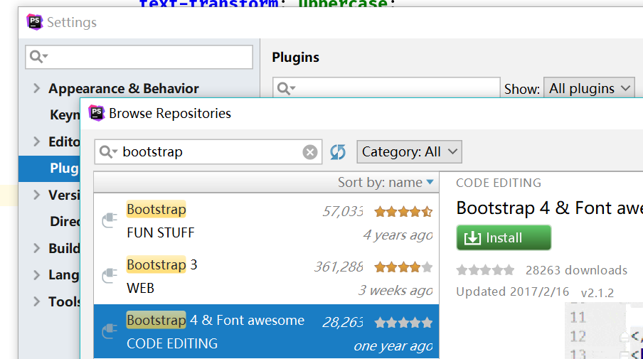
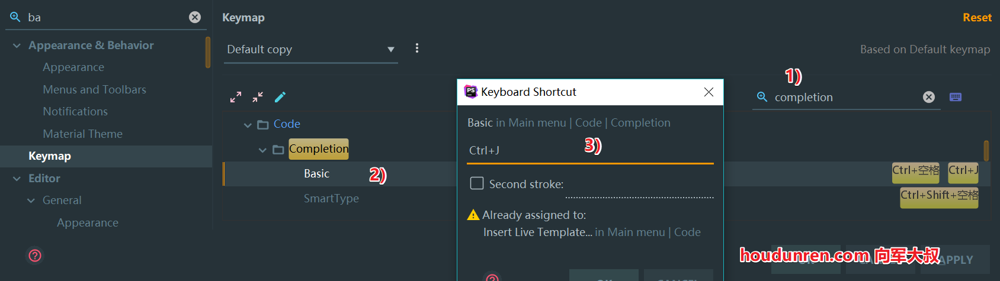
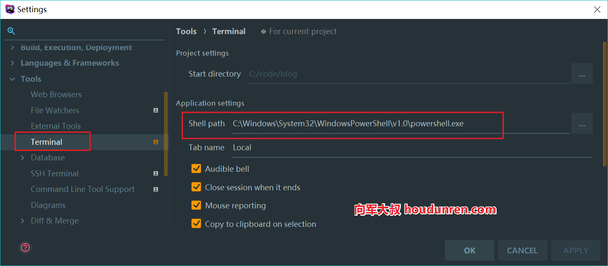
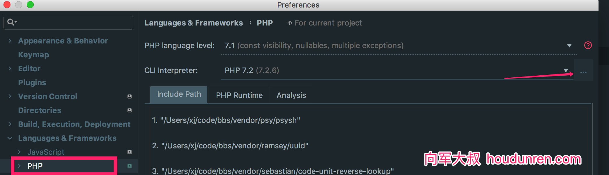
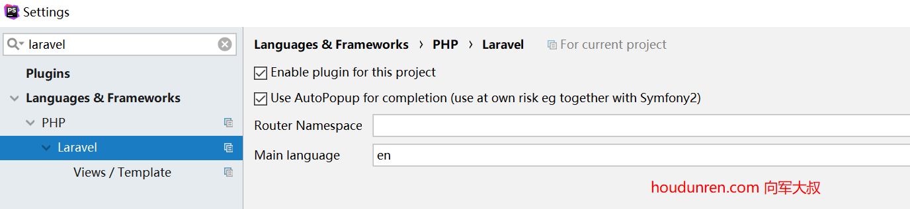
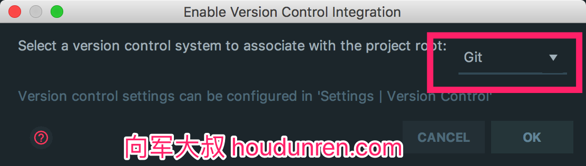
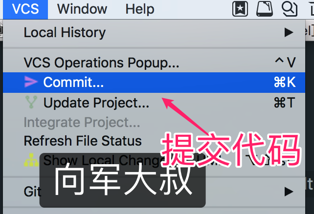
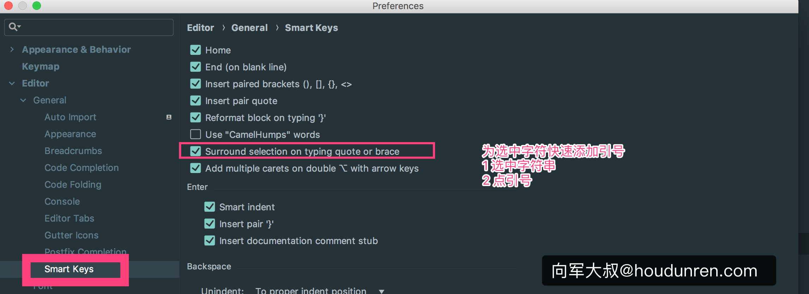
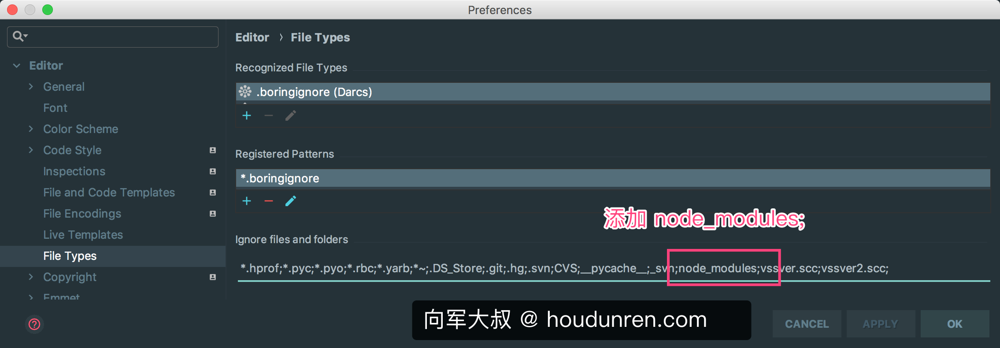

#  PHPSTORM


> 后盾人 www.houdunren.com  作者：[向军大叔](http://www.aoxiangjun.com)

下面在windows系统中介绍PHPSTORM使用,MAC使用与windows只是键盘布局差异。所以就不重复介绍了。 

## 风格

1. 安装插件 `Material Theme UI  ` ，安装后重起phpstorm
2. `Tools -> Material Theme ` 中选择喜欢的样式就可以了

## 快捷键

 

1. 全屏幕快捷键 

   ```
   Keymap>Main menu>View>Toggle Distraction Free mode 为 f11健
   Keymap>Main menu>View>Toggle Full Screen mode 为 alt f11健
   ```

2. `Keymap>Tool Windows>Database`  数据库管理 `alt+shift+d`

3. `Terminal` 快捷键就使用默认的 `alt+shift+t`

4. `Remote Host` 远程主机面板 `alt+shift+h`

5. `Run Command` 切换命令控制台 `alt+shift+m` 

6. `File Structure` 查找文件定义的方法 `alt+shift+j`  

7. ` Navigate>File` 查找文件 `alt+p` 

8. ` Recent Files` 查找文件定义的方法 `alt+e`  

9. `Editor Tabs>Close` 关闭文件 `alt+w`  

10. `File>Save All` 保存全部 `alt+s`  

11. `Code>Generate` 快捷创建 `alt+n`

>  使用 `MAC`的同学习惯于  `Command` 键，所以本套按键设置大量定义了 `alt` 键 

## bootstrap



## 关闭angular提示

以前使用angular.js比较多，现在主要使用vue.js，所在angular.js的提示暂时不需要。

`settings>Editor>Live Templates`


## Blade

PHPstorm 默认支持Laravel的blade 模板提示，但我们需要定义一下快捷键。




## 修改代码风格

`Editor>Code Style>PHP` 点击 `Set From...`  ,我使用的是`Symfony2`


## Shell

windows10 更改 Shell（用于全局使用ls，rm等Linux命令），Mac与Linux不需要设置。



```
C:\Windows\System32\WindowsPowerShell\v1.0\powershell.exe
```

## 字体大小设置

鼠标滚动改变大小

```
Preferences | Editor | Font >Change font Size(Zoom)...
```

改变编辑区大小

```
Preferences | Editor | Font
```

改变终端字体大小

```
Preferences | Editor | Color Scheme | Console Font
```

改变文件列表等dialog字体大小

```
Preferences | Appearance & Behavior | Appearance > Use custom font
```

>  一般我录制课程的设置是 编辑区 35，终端35，文件列表25

## PHP命令

Phpstorm中大量使用composer或命令行指令，所以需要设置合适的php命令




## 创建项目

软件启动时 `Create New Project` 或 选择菜单 `File>new Project` ，下面是演示安装 `Laravel` 项目


## Laravel

### Laravel Plugin

在phpstorm中安装 `laravel plugin` 插件.

`Settings > Languages & Frameworks > PHP > Laravel `  点击开启 `Enable for this project`



### laravel-ide-helper

laravel-ide-helper 用于实现方便的代码提示功能，详细[查看插件官网](https://github.com/barryvdh/laravel-ide-helper)

使用composer安装插件

```
composer require --dev barryvdh/laravel-ide-helper
```

生成代码跟踪支持 

```
php artisan ide-helper:generate
```

### 其他插件

在 IDE 中设置中搜索插件 `Preferences | Plugins`需要安装的插件列表如下：

- Laravel Plugin
- Laravel Snippets

### 命令提示

`settings>Tools>Command Line Tool Support` 


## Git

phpstorm很好的内置支持版本库管理。选择菜单 `VCS>Enable Version Control Integration`



安装 `.ignore` 插件用于管理 Git的 `.gitignore` 文件


提交代码



## editorconfig

editorConfig可以帮助开发人员在不同的编辑器和IDE中定义和维护一致的编码风格。下面是`laravel` 项目的配置，也是大叔使用的配置。官网 https://editorconfig.org/

主流开源项目的 `editorconfig` 配置 https://github.com/editorconfig/editorconfig/wiki/Projects-Using-EditorConfig

在 `phpstorm` 插件中安装 `editorconfig` 插件，然后在项目根目录创建 `.editorconfig` 文件内容如下：

```
root = true

[*]
charset = utf-8
end_of_line = lf
insert_final_newline = true
indent_style = space
indent_size = 4
trim_trailing_whitespace = true

[*.md]
trim_trailing_whitespace = false

[*.yml]
indent_style = space
indent_size = 2
```

说明

```
indent_style    设置缩进风格(tab是硬缩进，space为软缩进)
indent_size     用一个整数定义的列数来设置缩进的宽度，如果indent_style为tab，则此属性默认为tab_width
tab_width       用一个整数来设置tab缩进的列数。默认是indent_size
end_of_line     设置换行符，值为lf、cr和crlf
charset         设置编码，值为latin1、utf-8、utf-8-bom、utf-16be和utf-16le，不建议使用utf-8-bom
trim_trailing_whitespace  设为true表示会去除换行行首的任意空白字符。
insert_final_newline      设为true表示使文件以一个空白行结尾
root        　　　表示是最顶层的配置文件，发现设为true时，才会停止查找.editorconfig文件   
```

## composer

composer.json 配置文件管理，需要安装插件


## 其他设置

### 取消格式化代码时 自动换行


### 快速加符号

为选中字符快速添加引号或其他包裹符号。



### 解决NPM变慢的问题

生成 `node_modules` 目录后，加载特别慢并会卡死，解决方法如下：



### 自动换行

```
Preferences | Editor | General | Use soft wraps in editor
```

