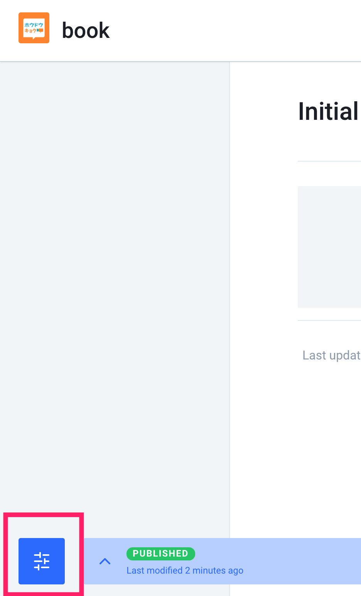

# gitbook

## 基本使用

#### 安装

需要注意的是：用户首先需要安装 nodejs，以便能够使用 npm 来安装 gitbook。

```
npm install gitbook -g
//查看安装的版本
gitbook -V
```

#### 初始化

```
//创建目录
mkdir houdunren
//初始化图书
gitbook init
```

#### 构建

使用下面的命令，会在项目的目录下生成一个 `_book` 目录，里面的内容为静态站点的资源文件：

```
gitbook build
```

#### 启动服务

使用下列命令会运行一个 web 服务, 通过 `http://localhost:4000/` 可以预览书籍

```
gitbook serve
```

#### 目录结构

### GitBook 项目结构

GitBook使用简单的目录结构。在 [SUMMARY](https://toolchain.gitbook.com/pages.html) （即 `SUMMARY.md` 文件）中列出的所有 Markdown / Asciidoc 文件将被转换为 HTML。多语言书籍结构略有不同。

一个基本的 GitBook 电子书结构通常如下：

```
.
├── book.json
├── README.md
├── SUMMARY.md
├── chapter-1/
|   ├── README.md
|   └── something.md
└── chapter-2/
    ├── README.md
    └── something.md
```

文件说明：

| 文件          | 描述                              |
| ------------- | --------------------------------- |
| `book.json`   | 配置数据 (**optional**)           |
| `README.md`   | 电子书的前言或简介 (**required**) |
| `SUMMARY.md`  | 电子书目录 (**optional**)         |
| `GLOSSARY.md` | 词汇/注释术语列表 (**optional**)  |

#### 目录

GitBook 使用 `SUMMARY.md` 文件来定义本书的章节和子章节的结构。 `SUMMARY.md` 文件用于生成本书的目录。

`SUMMARY.md` 的格式是一个链接列表。链接的标题将作为章节的标题，链接的目标是该章节文件的路径。

向父章节添加嵌套列表将创建子章节。

**示例：**

```
# Summary

* [Part I](part1/README.md)
    * [Writing is nice](part1/writing.md)
    * [GitBook is nice](part1/gitbook.md)
* [Part II](part2/README.md)
    * [We love feedback](part2/feedback_please.md)
    * [Better tools for authors](part2/better_tools.md)
```

**部分**

目录可以分为以标题或水平线 `----` 分隔的部分：

```
# Summary

### Part I

* [Writing is nice](part1/writing.md)
* [GitBook is nice](part1/gitbook.md)

### Part II

* [We love feedback](part2/feedback_please.md)
* [Better tools for authors](part2/better_tools.md)

----

* [Last part without title](part3/title.md)
```

Parts 只是章节组，没有专用页面，但根据主题，它将在导航中显示。

#### 常用命令

1. gitbook help //列出gitbook所有的命令
2. gitbook --help //输出gitbook-cli的帮助信息
3. gitbook build //生成静态网页
4. gitbook serve //生成静态网页并运行服务器
5. gitbook update //更新到gitbook的最新版本

##### 配置

配置在 `book.json` 文件中设置。下面是一个标准的配置文件。

需要执行  `gitbook install` 安装配置文件中的插件

```
{
    "title": "向军大叔",
    "description": "向军大叔技术分享",
    "author": "向军大叔",
    "output.name": "site",
    "language": "zh-hans",
    "gitbook": "3.2.3",
    "root": ".",
    "structure": {
        "readme": "README.md"
    },
    "links": {
        "sidebar": {
            "后盾人": "http://www.houdunren.com"
        }
    },
    "plugins": [
        "-lunr",
        "-search",
        "-highlight",
        "-livereload",
        "search-plus@^0.0.11",
        "simple-page-toc@^0.1.1",
        "github@^2.0.0",
        "github-buttons@2.1.0",
        "edit-link@^2.0.2",
        "disqus@^0.1.0",
        "prism@^2.1.0",
        "prism-themes@^0.0.2",
        "advanced-emoji@^0.2.1",
        "anchors@^0.7.1",
        "include-codeblock@^3.0.2",
        "ace@^0.3.2",
        "emphasize@^1.1.0",
        "katex@^1.1.3",
        "splitter@^0.0.8",
        "mermaid-gb3@2.1.0",
        "tbfed-pagefooter@^0.0.1",
        "expandable-chapters-small@^0.1.7",
        "sectionx@^3.1.0",
        "donate@^1.0.2",
        "local-video@^1.0.1",
        "sitemap-general@^0.1.1",
        "anchor-navigation-ex@0.1.8",
        "favicon@^0.0.2",
        "todo@^0.1.3",
        "3-ba@^0.9.0",
        "terminal@^0.3.2",
        "alerts@^0.2.0",
        "include-csv@^0.1.0",
        "puml@^1.0.1",
        "musicxml@^1.0.2",
        "klipse@^1.2.0",
        "versions-select@^0.1.1",
        "rss@^3.0.2",
        "-sharing",
        "sharing-plus@^0.0.2",
        "graph@^0.1.0",
        "chart@^0.2.0"
    ],
    "pluginsConfig": {
        "theme-default": {
            "showLevel": true
        },
        "disqus": {
            "shortName": "xiangjun"
        },
        "prism": {
            "css": [
                "prism-themes/themes/prism-base16-ateliersulphurpool.light.css"
            ]
        },
        "github": {
            "url": "https://github.com/houdunwang/book"
        },
        "github-buttons": {
            "repo": "houdunwang/book",
            "types": [
                "star"
            ],
            "size": "small"
        },
        "include-codeblock": {
            "template": "ace",
            "unindent": true,
            "edit": true
        },
        "sharing": {
           "douban": false,
           "hatenaBookmark": false,
           "instapaper": false,
           "line": false,
           "linkedin": false,
           "messenger": false,
           "pocket": false,
           "qq": true,
           "qzone": true,
           "stumbleupon": false,
           "twitter": false,
           "viber": false,
           "vk": false,
           "weibo": true,
           "whatsapp": false,
           "all": [
               "douban", "twitter", "line","facebook"
           ]
       },
        "tbfed-pagefooter": {
            "copyright": "Copyright © <a href='http://aoxiangjun.com'>aoxiangjun.com</a> 2019",
            "modify_label": "该文件修订时间：",
            "modify_format": "YYYY-MM-DD HH:mm:ss"
        },
        "3-ba": {
            "token": "ff100361cdce95dd4c8fb96b4009f7bc"
        },
        "donate": {
            "wechat": "http://www.hdcms.com/xiangjunpayqr/wechat.JPG",
            "alipay": "http://www.hdcms.com/xiangjunpayqr/alipay.JPG",
            "title": "",
            "button": "赏",
            "alipayText": "支付宝打赏",
            "wechatText": "微信打赏"
        },
        "simple-page-toc": {
            "maxDepth": 3,
            "skipFirstH1": true
        },
        "edit-link": {
            "base": "https://github.com/houdunwang/book/edit/master",
            "label": "Edit This Page"
        },
        "sitemap-general": {
            "prefix": "http://gitbook.houdunren.com"
        },
        "anchor-navigation-ex": {
            "isRewritePageTitle": false,
            "tocLevel1Icon": "fa fa-hand-o-right",
            "tocLevel2Icon": "fa fa-hand-o-right",
            "tocLevel3Icon": "fa fa-hand-o-right"
        },
        "sectionx": {
            "tag": "b"
        },
        "favicon": {
            "shortcut": "favicon.ico",
            "bookmark": "favicon.ico"
        },
        "terminal": {
            "copyButtons": true,
            "fade": false,
            "style": "flat"
        },
        "rss": {
            "title": "向军大叔技术文档分享",
            "description": "向军大叔技术文档分享",
            "author": "向军大叔",
            "feed_url": "http://gitbook.zhangjikai.com/rss",
            "site_url": "http://www.houdunren.com/",
            "managingEditor": "2300071698@qq.com",
            "webMaster": "2300071698@qq.com",
            "categories": [
                "gitbook"
            ]
        }
    }
}
```


## gitbook.com

#### 新建书籍




