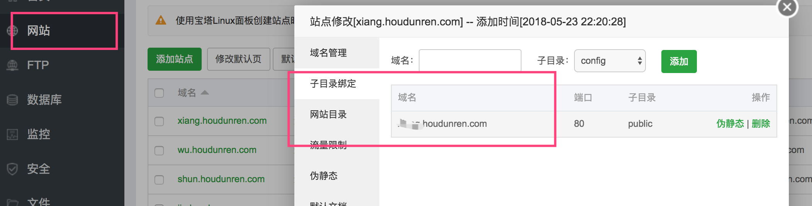
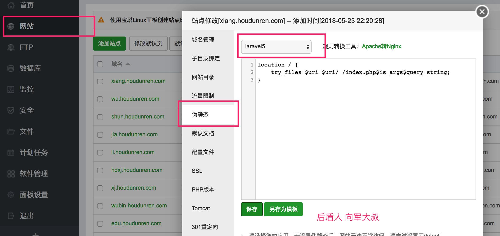

# LARAVEL 教程文档

> 后盾人 www.houdunren.com  作者：[向军大叔](http://www.aoxiangjun.com)

## 介绍

Laravel是一套简洁、优雅的PHP Web开发框架(PHP Web Framework)。它可以让你从面条一样杂乱的代码中解脱出来；它可以帮你构建一个完美的网络APP，而且每行代码都可以简洁、富于表达力。

Laravel 是 基于 PHP 语言的 Web 开源框架，采用了 MVC 的架构模式，在 2011 年 6 月正式发布了首个版本。
深度集成 PHP 强大的扩展包（Composer）生态与 PHP 开发者广大的受众群，让 Laravel 在发布之后的短短几年时间得到了极其迅猛的发展。我们通过 Google Trends 提供的趋势图（图 1.1）可以看出，Laravel 框架在过去十年，其增长速度迅猛。


**laravel是GitHub上PHP项目排名第一的**


## 版本

#### Lts

Long-Term Support,长期技术支持（版本），该版本拥有较长的维护周期，是商业项目优先考虑使用的版本。

#### 常规版

提供6个月的bug修复，维护周期短但功能较新，学习为了使用新功能可采用这个版本。

## 全新安装

使用composer安装laravel框架

```
composer create-project --prefer-dist laravel/laravel blog
```

安装完 Laravel 之后，你必须将 web 服务器更目录指向 `public` 目录。该目录下的 `index.php` 文件将作为所有进入应用程序的 HTTP 请求的前端控制器。

需要修改 `.env` 配置文件中的 `APP_NAME` 与 `APP_URL`

```
APP_NAME=后盾人
APP_URL=http://houdunren.com
```

## Mysql低版本

如果你是在版本低于 5.7.7 的 MySQL release 上创建索引，那就需要你手动配置迁移生成的默认字符串长度。

在 AppServiceProvider.php 文件里的 boot 方法里设置 

```
public function boot()
{
 	\Schema::defaultStringLength(191);
}
```

## 下载他人项目

检出别人的项目时，因为.env、verdor、node_moduels文件或目录是不提交到版本库的，造成检出后项目不能正常运行。需要以下几步处理：

1. composer install
2. cnpm install
3. 复制 .env.example 文件为 .env文件
4. 执行  `php artisan key:generate`  生成应用秘钥
5. 修改 .env 配置文件其他数据为你网站数据（比如数据库配置等）

## 基本使用

#### 路由

laravel 的路由类型很多，为了对大家不造成学习压力。我们先讲解基础的使用，后面会深入讲到其他路由处理方式。

修改 routes/web.php 路由表文件。

```
Route::get('/home', 'TestController@home');
Route::get('/lists', 'TestController@lists');
Route::get('/show', 'TestController@show');
```

#### 控制器

创建控制器

```
php artisan make:controller TestController
```

内容如下：

```
<?php namespace App\Http\Controllers;
use Illuminate\Http\Request;
class TestController extends Controller
{
	public function home(){
		return __METHOD__;
	}

	public function lists(){
		return __METHOD__;
	}

	public function show(){
		return __METHOD__;
	}
}
```

浏览器中访问 `http://laravel.hd/lists ` 显示内容如下

```
App\Http\Controllers\TestController::lists
```

以上就是laravel中基本路由与控制器的操作流程。

## 视图

视图就是我们显示的页面，视图保存在 `resources/views` 文件夹中。

#### 继承

模板继承是为了共用相同页面数据，减少代码冗余。

下面定义 views/layouts/master.blade.php 文件

```
<!DOCTYPE html>
<html lang="en">
<head>
	<meta charset="UTF-8">
	<title>
		@yield('title', '后盾人')
	</title>
</head>
<body>
	@yield('content')
</body>
</html>
```

然后在子模板中引入父模板，并使用section替换父模板中yield定义的占位内容。

```
@extends('layouts.master')
@section('title','后盾人 - 首页')
@section('content')
	<h1>首页1</h1>
@endsection
```

#### include

include用于加载外部模板

```
@include('user.show')
```

被引入的视图会继承父视图中的所有数据，同时也可以向引入的视图传递额外的数组数据：

```
@include('view.name', ['some' => 'data'])
```

#### includeIf

当然，如果尝试使用 `@include` 去引入一个不存在的视图，Laravel 会抛出错误。如果想引入一个可能存在或可能不存在的视图，就使用 `@includeIf` 指令:

```
@includeIf('view.name', ['some' => 'data'])
```

#### includeWhen

如果要根据给定的布尔条件 `@include` 视图，可以使用 `@includeWhen` 指令：

```
@includeWhen($boolean, 'view.name', ['some' => 'data'])
```

#### stack

Blade 可以被推送到在其他视图或布局中的其他位置渲染的命名堆栈。这在子视图中指定所需的 JavaScript 库时非常有用：

父模板使用

```
<head>
    <!-- Head Contents -->
    @stack('scripts')
</head>
```

子模板

```
@push('scripts')
    <script src="/example.js"></script>
@endpush
```

#### component&slot

组件相比 @extends 更灵活些，下面是定义一个 `modal` 组件。

组件中的变量可以在调用组件时传参数

```
@component('components.modal',['title'=>'你好','url'=>route('home')])
```

也可以使用 `slot` 标签赋值

```
@slot('footer')
<button type="button" data-dismiss="modal" class="btn btn-secondary md-close">cancel</button>
@endslot
```

**示例**

定义一个模态框组件 `view/components/modal.blade.php`

```
<form action="{{$url}}" method="post" {!!isset($id)?"id=\"$id\"":''!!}>
    @csrf
    @isset($method) @method($method) @endif
    <div id="form-bp1" tabindex="-1" role="dialog" class="modal fade colored-header colored-header-primary">
        <div class="modal-dialog">
            <div class="modal-content">
                <div class="modal-header modal-header-colored">
                    <h3 class="modal-title">
                        @isset($title) {{$title}} @endisset
                    </h3>
                    <button type="button" data-dismiss="modal" aria-hidden="true" class="close md-close"><span class="mdi mdi-close"></span></button>
                </div>
                <div class="modal-body">
                    {{$slot}}
                </div>
                <div class="modal-footer">
                    @isset($footer)
                        {{$footer}}
                    @else
                        <button type="button" data-dismiss="modal" class="btn btn-secondary md-close">关闭</button>
                        <button type="button" data-dismiss="modal" class="btn btn-primary md-close">保存</button>
                    @endif
                </div>
            </div>
        </div>
    </div>
</form>
```

模板中调用 `modal` 组件

```
@component('components.modal',['title'=>'你好','url'=>route('home'),'method'=>'PUT'])
<div class="form-group row">
 <label for="inputText3" class="col-12 col-sm-3 col-form-label text-sm-right">
   Input Text
 </label>
 <div class="col-12 col-sm-12 col-lg-6">
  <input id="inputText3" type="text" class="form-control form-control-sm">
 </div>
</div>
@slot('footer')
<button type="button" data-dismiss="modal" class="btn btn-secondary md-close">cancel</button>
<button type="button" data-dismiss="modal" class="btn btn-primary md-close">save</button>
@endslot
@endcomponent
```

### 动态视图目录

有时我们需要经常改变视图目录

```
$finder = app('view')->getFinder();
$finder->prependLocation(public_path('templates/'));
```

## 脚手架

安装cnpm 使用国内镜像，安装速度快。

```
npm install -g cnpm --registry=https://registry.npm.taobao.org
```

根据packagist.json 安装前端库

```
cnpm install
cnpm install cross-env
```

我们需要在 resources/assets 目录下的js 与 css 目录中编写前端文件。

**执行编译**

编写好文件事我们需要执行编译操作，生成可供浏览器访问的文件，默认生成在 public/css 与 public/js目录中

```
npm run dev
```

引入编译好的样式文件

```
<link rel="stylesheet" href="/css/app.css">
```

文件监听**

每次修改都手动编译效率很低，执行以下命令后Webpack 会在检测到文件更改时自动重新编译资源：

```
npm run watch
```

在某些环境中，当文件更改时，Webpack 不会更新。如果系统出现这种情况，请考虑使用 `watch-poll` 命令：

```
npm run watch-poll
```

**Bootstrap**

在app.scss 文件中定义：

```
@import '~bootstrap/scss/bootstrap'; 
```

## 路由别名

进入路由跳转使用 `/home` 等形式可以正常进行，但如果我们有很多页面 使用了这种方式，后期我们将 `/home` 更改为了 `/root`，就要修改多个页面，显然不是很方式 。这时我们可以为路由起别名。

```
Route::get('/home', 'TestController@home')->name('home');
```

页面中使用调用即可

```
<a class="nav-link" href="{{ route('home') }}">网站首页</a>
```

## 数据迁移

迁移就像是数据库的版本控制, 允许团队简单轻松的编辑并共享应用的数据库表结构。

迁移文件默认保存在 `database/migrations` 文件夹中。

> 课程使用homestead 配置，要保证.env配置正确，并保证主机客户端连接正常

**运行迁移**

使用 Artisan命令 `migrate` 方法来运行所有未完成的迁移：

```
php artisan migrate
```

**回滚迁移**

若要回滚最后一次迁移， 可以使用 `rollback` 命令。 此命令将回滚最后一次“迁移”的操作，其中可能包含多个迁移文件：

```
php artisan migrate:rollback
```

#### 关联外键约束

下面是文章表category_id与栏目表的id关联约束设置，当栏目删除时栏目下的所有文章自动删除。

```
$table->unsignedInteger('category_id')->comment('栏目');
$table->foreign('category_id')->references('id')->on('categories')->onDelete('cascade');
```

## 模型

Laravel 的 Eloquent ORM 提供了漂亮、简洁的 ActiveRecord 实现来和数据库交互。每个数据库表都有一个对应的「模型」用来与该表交互。你可以通过模型查询数据表中的数据，并将新记录添加到数据表中。

#### 定义模型

首先，创建一个 Eloquent 模型，默认生成的模型通常放在 `app` 目录中。

创建模型实例的最简单方法是使用 [Artisan 命令](https://laravel-china.org/docs/laravel/5.6/artisan) `make:model`：

```
php artisan make:model Article
```

如果要在生成模型时生成 [数据库迁移](https://laravel-china.org/docs/laravel/5.6/migrations) ，可以使用 `--migration` 或 `-m` 选项：

```
php artisan make:model Article -m
```

#### 数据表名称

可以通过在模型上定义 `table` 属性，来指定自定义数据表。如果不指定时使用模型名加s，如Article 对应表名为articles

```
 protected $table = 'articles';
```

#### 时间戳

默认情况下，Eloquent 会默认数据表中存在 `created_at` 和 `updated_at` 这两个字段。如果你不需要这两个字段，则需要在模型内将 `$timestamps` 属性设置为 `false` ：

```
//该模型是否被自动维护时间戳
public $timestamps = false;
```

#### 本地作用域

本地作用域能定义通用的约束集合以便在应用中复用。

```
class User extends Model
{
    /**
     * 查询用户活跃类型 1 活跃 2 不活跃
     *
     * @return \Illuminate\Database\Eloquent\Builder
     */
    public function scopeActive($query,$type=1)
    {
        return $query->where('active', $type);
    }
}
```

使用方法

```
$users = App\User::active(1)->get();
```

#### associate

当更新 `belongsTo` 关联时，可以使用 `associate` 方法。此方法将会在子模型中设置外键：

```
$account = App\Account::find(10);

$user->account()->associate($account);

$user->save();
```

#### 软删除

软件删除不是真正删除数据，只是在表中更改 deleted_at 状态完成，步骤如下：

**修改模型**

在模型上使用 `Illuminate\Database\Eloquent\SoftDeletes` trait 并把 `deleted_at` 字段加入 `$dates` 属性：

```
...
use Illuminate\Database\Eloquent\SoftDeletes;

class Video extends Model
{
    use SoftDeletes;
    ...
}
```

**修改迁移文件**

```
Schema::create('videos', function (Blueprint $table) {
    $table->softDeletes();
});
```

现在，模型调用 `delete` 方法，当前日期时间会写入 `deleted_at` 字段。同时，查询出来的结果也会自动剔除软删除的模型。

**包括软删除的模型**

```
 App\Videos::withTrashed()->get();
```

`withTrashed` 方法也可以用在关联查询：

**只检索软删除的模型**

```
App\Videos::onlyTrashed()->get();
```

**恢复软删除模型**

```
App\Videos::get()->restore();
```

**永久删除**

```
$videos->forceDelete();
```

> 基本上软删除都可以用在关联操作中

## 登录历史跳转

使用系统 auth 验证时，会自动 记录当前的url，然后登录成功后使用以下代码就会跳转到来源地址。

```
return redirect()->intended('/');
```

inteded方法参数默认为 `/` ，即没有历史来源时的跳转地址。

如果是自定义的验证，则需要使用以下代码记录来源地址。登录成功后还是使用上面代码跳转就可以了。

```
return redirect()->guest(route('login'))->with('error', '请登录后操作');
```

guest参数必填即登录地址。

如果想自行定义登录后的回调地址使用下面方法

```
session(['url.intended'=>$request->getRequestUri()]);
```

## 分页

```
$users = User::paginate(10);
```

模板中显示分页列表

```
$users->links();
```

分页时传递GET参数

```
$users->appends(Request::except('page'))->links()
```


## 监听SQL

```
DB::enableQueryLog();  
执行语句  
dd(DB::getQueryLog());  
```

## TINKER

使用laravel提供的tinker 可以方便的在命令行进行调试。

**进入tinker环境**

```
php artisan tinker
```

**新增用户练习**

```
>>> use \App\User
>>> $user = new User
>>> $user->create(['name'=>'houdunren','password'=>bcrypt('admin888'),'email'=>'2300071698@qq.com'])
```

> bcrypt 是用来对密码进行加密

**查看用户**

```
>>> User::first()
>>> User::all()
```

**修改记录**

下面使用save方法操作

```
>>> $user = User::first()
>>> $user->name='后盾人网站'
>>> $user->save()
```

下面使用update批量更新

```
>>> $user = User::first()
>>> $user->update(['name'=>'后盾人','password'=>bcrypt('admin')])
```

## 路由参数

比如我们定义下面的路由规则，其中 {user} 和 {name} 为路由中的参数变量

```
Route::get('/user/{user}/{name}','UserController@show')->name('user.show');

```

控制器中获取参数方式如下:

```
<?php namespace App\Http\Controllers;
use Illuminate\Http\Request;
class UserController extends Controller
{
    public function show($user,$name){
    	dd($user.'='.$name);
    }
}

```

## 隐性路由模型绑定

Laravel 会自动解析定义在路由或控制器行为中与类型提示的变量名匹配的路由段名称的 Eloquent 模型。例如：

```
Route::get('api/users/{user}', function (App\User $user) {
    return $user->email;
});

```

在这个例子中，由于 `$user` 变量被类型提示为 Eloquent 模型 `App\User`，变量名称又与 URI 中的 `{user}` 匹配，因此，Laravel 会自动注入与请求 URI 中传入的 ID 匹配的用户模型实例。如果在数据库中找不到对应的模型实例，将会自动生成 404 异常。

## 资源控制器

Laravel 遵从 RESTful 架构的设计原则，将数据看做一个资源。Laravel 资源路由将典型的「CRUD」路由分配给具有单行代码的控制器。

使用 Artisan 命令 `make:controller` 来快速创建控制器：

```
php artisan make:controller ArticleController --resource

```

接下来，你可以给控制器注册一个资源路由：

```
Route::resource('photos', 'PhotoController');

```

**资源控制器方法说明：**

| 动作      | URI                    | 行为    | 路由名称       |
| --------- | ---------------------- | ------- | -------------- |
| GET       | `/photos`              | index   | photos.index   |
| GET       | `/photos/create`       | create  | photos.create  |
| POST      | `/photos`              | store   | photos.store   |
| GET       | `/photos/{photo}`      | show    | photos.show    |
| GET       | `/photos/{photo}/edit` | edit    | photos.edit    |
| PUT/PATCH | `/photos/{photo}`      | update  | photos.update  |
| DELETE    | `/photos/{photo}`      | destroy | photos.destroy |

> 可以使用 `php artisan route:list` 查看已经定义的路由

#### 指定资源模型

如果你使用了路由模型绑定，并且想在资源控制器的方法中使用类型提示，你可以在生成控制器的时候使用 `--model` 选项：

```
php artisan make:controller PhotoController --resource --model=Photo

```

#### 伪造表单方法

因为 HTML 表单不能生成 `PUT`、 `PATCH` 或者 `DELETE` 请求，所以你需要添加一个隐藏的 `_method` 输入字段来伪造这些 HTTP 动作。辅助函数 `method_field` 可以帮你创建这个字段：

```
{{ method_field('PUT') }}

```

## 表单验证

下面是控制器中的 store 方法

```
public function store(Request $request)
{
    $this->validate($request, [
        'title' => 'required|unique:posts|max:255',
        'body' => 'required',
    ]);

    // 文章内容是符合规则的，存入数据库
}

```

#### 常用规则

| 规则      | 说明说明                                                     | 示例                                    |
| --------- | ------------------------------------------------------------ | --------------------------------------- |
| confirmed | 验证的字段必须和 `foo_confirmation` 的字段值一致。例如，如果要验证的字段是 `password`，输入中必须存在匹配的 `password_confirmation` 字段。 |                                         |
| size      | 验证的字段必须具有与给定值匹配的大小。对于字符串来说，*value* 对应于字符数。对于数字来说，*value* 对应于给定的整数值。对于数组来说， *size* 对应的是数组的 `count` 值。对文件来说，*size* 对应的是文件大小（单位 kb ）。 |                                         |
| max       | 验证中的字段必须小于或等于 *value*。字符串、数字、数组或是文件大小的计算方式都用 [`size`](https://laravel-china.org/docs/laravel/5.5/validation#rule-size) 方法进行评估。 |                                         |
| min       | 验证中的字段必须具有最小值。字符串、数字、数组或是文件大小的计算方式都用 [`size`](https://laravel-china.org/docs/laravel/5.5/validation#rule-size) 方法进行评估。 |                                         |
| unique    | unique:*table*,*column*,*except*,*idColumn*验证的字段在给定的数据库表中必须是唯一的。如果没有指定 `column`，将会使用字段本身的名称 | 'email' => 'unique:users,email_address' |
| required  | 验证的字段必须存在于输入数据中，而不是空。如果满足以下条件之一，则字段被视为「空」：   该值为 `null`.  该值为空字符串。  该值为空数组或空的 `可数` 对象。  该值为没有路径的上传文件。 |                                         |
| email     | 验证的字段必须符合 e-mail 地址格式。                         |                                         |
| sometimes | **只有**在该字段存在时， 才对字段执行验证                    |                                         |
| nullable  | 如果你不希望验证程序将 `null` 值视为无效的，那就将「可选」的请求字段标记为 `nullable`，也可以理解为有值时才验证。 |                                         |

```
$request->validate([
    'title' => 'required|unique:posts|max:255',
    'body' => 'required',
    'publish_at' => 'nullable|date',
]);

```

在这个例子里，我们指定 `publish_at` 字段可以为 `null` 或者一个有效的日期格式。如果 `nullable` 的修饰词没有被添加到规则定义中，验证器会认为 `null` 是一个无效的日期格式。

> 更多验证规则使用时请查阅手册 https://laravel.com/docs/5.6/validation


#### 显示验证错误

如果表单验证失败，laravel会向分配错误信息到 `$errors` 中，那么我们就可在模板中使用以下代码展示验证错误。

```
@if (count($errors) > 0)
    <div class="alert alert-danger">
        <ul>
            @foreach ($errors->all() as $error)
                <li>{{ $error }}</li>
            @endforeach
        </ul>
    </div>
@endif

```

#### 表单验证请求

面对更复杂的验证情境中，你可以创建一个「表单请求」来处理更为复杂的逻辑。

**创建验证请示**

```
php artisan make:request StoreBlogPost
```

下面是一个示例

```
class UserRequest extends FormRequest
{
    public function authorize()
    {
        return true;
    }

    public function rules()
    {
        return [
            'name'  => 'required|between:5,20',
            'email' => "required|email|unique:users,email,".\Auth::user()->id,
            'introduce'=>"required|max:80|min:10",
            'avatar'=>'mimes:jpeg,bmp,png|dimensions:min_width=300,min_height=200'
        ];
    }

    public function messages()
    {
        return [
            'name.required' => '昵称 不能为空',
            'name.between'=>'昵称 必须介于 :min 与 :max 之间'
        ];
    }
}
```


## 表单函数

#### **csrf**

laravel （跨站请求伪造），Laravel 为了安全考虑，会让我们提供一个 token（令牌）来防止我们的应用受到 [CSRF](http://d.laravel-china.org/docs/5.5/routing#csrf-protection)（跨站请求伪造）的攻击。放置在表单（form）体内。

```
{{csrf_field()}}
```

#### **old**

`old`函数获取一次性存放在session中的值，用在表单的value属性中。这样当我们输出错误回调页面时，原来输入的值还存在。

```
<input type="text" class="form-control" name="name" value={{old('name')}}>
```

## 表单请求验证

面对更复杂的验证情境中，你可以创建一个「表单请求」来处理更为复杂的逻辑

```
php artisan make:request StoreBlogRequest

```

新生成的类保存在 `app/Http/Requests` 目录下。

```
<?php namespace App\Http\Requests;
use Illuminate\Foundation\Http\FormRequest;
class UserRequest extends FormRequest
{
    //权限验证
    public function authorize()
    {
        return true;
    }
    //验证规则
    public function rules()
    {
        return [
            'name'=>'required|max:20',
            'email'=>'required|email|unique:users|max:255',
            'password'=>'required|confirmed|min:5',
        ];
    }
    //提示信息
    public function messages()
    {
        return [
            'name.required' => '名称不能为空',
            'email.required'  => '邮箱不能为空',
        ];
    }
}
```

在控制器的方法中依赖注入就可以使用了

```
public function store(UserRequest $request){  
}
```

## 重定向

`redirect` 函数返回一个 HTTP 重定向响应，如果调用时没有传入参数则返回 redirector 实例：

```
return redirect('/home');
return redirect()->route('route.name');

```

传递路由参数

```
$user = User::first()
return redirect()->route('user.show',[$user]);

```

假设路由规则为 `Route::get('user/show/{user}')` ，上例中的`[$user]`会自动提出 $user模型对象的主键做为路由参数。

## 闪存数据

有时候你仅想在下一个请求之前在 Session 中存入数据，你可以使用 `flash` 方法。使用这个方法保存在 Session 中的数据，只会保留到下个 HTTP 请求到来之前，然后就会被删除。闪存数据主要用于短期的状态消息：

```
session()->flash('status', 'Task was successful!');
```

判断与获取闪存数据

```
@if (session()->has($msg))
	{{session()->get($msg)}}
@endif
```

#### 公共提示消息

开发中经常用到消息提示，比如登录成功、退出成功等。使用 闪存数据定义一个公共的提示信息组件，就可以解决这个问题。

**控制器**

```
public function store(UserRequest $request)
{
	session()->flash('success','注册成功，欢迎回家');
	return redirect()->route('user.show',[$user]);
}
```

公共消息模板  `resource/view/layouts/_message.blade.php` 

```
@foreach (['success','error','danger'] as $msg)
	@if (session()->has($msg))
		<div class="alert alert-{{$msg}}">
			{{session()->get($msg)}}
		</div>
	@endif
@endforeach

```

需要用到的页面能过 `@include` 引入即可

```
@include('layouts._message')

```

## 登录验证

使用 `Auth::attempt` 可以进行用户手动登录

```
public function authenticate()
{
	if (Auth::attempt(['email' => $email, 'password' => $password])) {
		// 认证通过...
		return redirect()->intended('dashboard');
	}
}

```

重定向器上的 `intended` 方法将重定向到用户尝试访问的 URL。如果该 URL 无效，会给该方法传递回退 URI。

传递历史表单，`withInput` 用于把历史表单返回给页面，这样页面中就可以使用 `old()` 函数显示历史输入数据了。

```
return redirect()->back()->withInput();

```

完整示例

```
class LoginController extends Controller
{
	public function store(Request $request){
		$user = $this->validate($request,[
			'email'=>'required',
			'password'=>'required',
		]);

		if(Auth::attempt($user)){
			return redirect('/');
		}else{
			session()->flash('danger','邮箱 或密码错误');
			return redirect()->back()->withInput();
		}
	}
}

```

判断用户是否已经登录

```
Auth::check();

```

如果需要将现有用户进行登录，可以使用用户实例调用 `login` 方法。可以实现用户注册完就登录。

```
$user = User::first();
Auth::login($user);

```

用户退出

```
public function logout(){
	Auth::logout();
	session()->flash('success','退出成功');
	return redirect()->route('login');
}

```

#### 资源路由传参

下面是资源路由中生成编辑资源url的方法。

```
{!! route('user.edit',$user->id) !!}

```

#### 历史跳转

 `intended` 方法将重定向到用户尝试访问的 URL。如果该 URL 无效，会给该方法传递回退 URI。比如当用户编辑资料时，但用户没有登录，会先跳到用户登录页面。使用intended 方法后登录成功后会回调到，编辑资料页面。如果没有历史，则跳转到 intended指定的参数路由。

```
return redirect()->intended('home');

```

## 模型事件

Eloquent 的模型触发了几个事件，可以在模型的生命周期的以下几点进行监控： `retrieved`、`creating`、`created`、`updating`、`updated`、`saving`、`saved`、`deleting`、`deleted`、`restoring`、`restored`。事件能在每次在数据库中保存或更新特定模型类时轻松地执行代码。

如果要给某个模型监听很多事件，则可以使用观察器将所有监听器分组到一个类中。观察器类里的方法名应该对应 Eloquent 中你想监听的事件。 每种方法接收 model 作为其唯一的参数。Laravel 没有为观察器设置默认的目录，所以你可以创建任何你喜欢你的目录来存放：

#### 定义事件

下面是User模型的观察器

```
<?php namespace app\Observers;
use App\User;
class UserObserver{
	public function creating(User $user){
		$user->active_token = str_random(20);
	}
	public function saving(User $user){}
}
```

#### 声明事件

在AppServiceProvicer服务提供者的 `boot` 方法执行以下代码

```
User::observe(UserObserver::class)
```

或者在模型中定义

```
namespace App;

use App\Observers\UserServer;
use Illuminate\Notifications\Notifiable;
use Illuminate\Foundation\Auth\User as Authenticatable;

class User extends Authenticatable
{
    ...
    protected static function boot()
    {
        parent::boot();
        User::observe(UserServer::class);
    }
}
```

## 权限策略

策略是在特定模型或者资源中组织授权逻辑的类。例如，针对用户的更新、修改操作就可以使用策略进行权限控制。 

#### 创建策略

```
php artisan make:policy UserPolicy --model=User
```

下面是一个策略类中的方法，$user为当前登录用户，$model为调用策略时传递的用户模型实例。表示如果当前登录用户与用户实例相同可以更新。

```
public function update(User $user, User $model)
{
	return $user->id == $model->id;
}
```

#### 声明策略

在 `app/Providers/AuthServiceProvider.php` 类的 `$policies` 属性中声明策略

```
protected $policies = [
	'App\Model' => 'App\Policies\ModelPolicy',
	'App\User'=>UserPolicy::class
];
```

#### 控制器中使用策略

```
$this->authorize('update', $user);
#后续业务代码..
```

#### 友好显示

当开启DEBUG时会抛出异常，关注后并定义 `403.blade.php` 模板后可以显示友好的提示。

```
errors/403.blade.php
```

## 邮件

#### 配置

下面是针对 qq邮箱的配置，其他邮箱请自行参考。

登录 `mail.qq.com` 你的邮箱。查找 `设置>帐户>POP3/IMAP/SMTP/Exchange/CardDAV/CalDAV服务` 开启pop3并获取授权码。

可以在 `config/mail.php` 文件或.env开发文件中设置，下面是.env中的配置项

```
MAIL_DRIVER=smtp
MAIL_HOST=smtp.qq.com
MAIL_PORT=25
MAIL_USERNAME=2300071698@qq.com
MAIL_FROM_ADDRESS=2300071698@qq.com
MAIL_PASSWORD=a334an2qgnjnoujbeaajj
MAIL_ENCRYPTION=tls

```

> MAIL_PASSWORD为 QQ 邮箱提供的摄权码

#### Mailable

在 Laravel 中，每种类型的邮件都代表一个「Mailable」对象。这些对象存储在 `app/Mail` 目录中。如果在你的应用中没有看见这个目录，别担心，在首次使用 `make:mail` 命令创建 Mailable 类时这个目录会被创建。

```
php artisan make:mail regMail
```

```
<?php namespace App\Mail;
use Illuminate\Bus\Queueable;
use Illuminate\Mail\Mailable;
use Illuminate\Queue\SerializesModels;
use Illuminate\Contracts\Queue\ShouldQueue;
class RegMail extends Mailable
{
    use Queueable, SerializesModels;
	//公共属性可以模板中直接使用
    public $user;
	//构造函数
    public function __construct($user)
    {
        $this->user = $user;
    }

    public function build()
    {
        return $this->view('mails.reg');
    }
}

```

#### 发送

执行以下代码就可以发送邮件了。

```
\Mail::to(User::first())->send(new \App\Mail\RegMail(User::find(1)));
```

> to：指发送给谁，字段中必须存在 email和name，send: 指使用的邮件处理器

## 集合

#### contains

`contains` 方法判断集合是否包含给定的项目 

```
$collection = collect(['name' => 'Desk', 'price' => 100]);
$collection->contains('Desk');
// true

$collection->contains('New York');
// false

```

#### pluck

`pluck` 方法可以获取集合中给定键对应的所有值：

```
$collection = collect([
    ['product_id' => 'prod-100', 'name' => 'Desk'],
    ['product_id' => 'prod-200', 'name' => 'Chair'],
]);

$plucked = $collection->pluck('name');

$plucked->all();

// ['Desk', 'Chair']

```

#### slice

`slice` 方法返回集合中给定值后面的部分：

```
$collection = collect([1, 2, 3, 4, 5, 6, 7, 8, 9, 10]);

$slice = $collection->slice(4);

$slice->all();

// [5, 6, 7, 8, 9, 10]

```

#### has

`has` 方法判断集合中是否存在给定的键：

```
$collection = collect(['account_id' => 1, 'product' => 'Desk']);

$collection->has('product');

// true

```

#### each

each` 方法将迭代集合中的内容并将其传递到回调函数中：

```
$collection = $collection->each(function ($item, $key) {
    //
});

```

#### count

`count` 方法返回该集合内的项目总数：

```
$collection = collect([1, 2, 3, 4]);

$collection->count();

```

## 多对多关联

#### attach

我们假设一个用户可以拥有多个角色，并且每个角色都可以被多个用户共享。给某个用户附加一个角色是通过向中间表插入一条记录实现的，可以使用 `attach` 方法完成该操作： 

```
$user = App\User::find(1);
$user->roles()->attach($roleId);

```

#### detach

有时也需要移除用户的角色。可以使用 `detach`移除多对多关联记录。`detach` 方法将会移除中间表对应的记录；但是这 2 个模型都将会保留在数据库中： 

```
// 移除用户的一个角色...
$user->roles()->detach($roleId);

// 移除用户的所有角色...
$user->roles()->detach();

```

#### sync

`sync` 方法接收一个 ID 数组以替换中间表的记录。中间表记录中，所有未在 ID 数组中的记录都将会被移除。所以该操作结束后，只有给出数组的 ID 会被保留在中间表中： 

```
$user->roles()->sync([1, 2, 3]);

```

如果你不想移除现有的 ID，可以使用 `syncWithoutDetaching` 方法：

```
$user->roles()->syncWithoutDetaching([1, 2, 3]);

```

#### allRelatedIds

`allRelatedIds` 用来获取关联模型的 ID 集合。

```
$user->roles()->allRelatedIds();
```

#### toggle

`toggle` 方法用于「切换」给定 ID 数组的附加状态。 如果给定的 ID 已被附加在中间表中，那么它将会被移除，同样，如果如果给定的 ID 已被移除，它将会被附加：

```
$user->roles()->toggle([1, 2, 3]);
```

## 消息通知

#### 创建通知

```
php artisan make:notification FindPasswordNotify
```

这个命令会在 `app/Notifications` 目录下生成一个新的通知类。 

### 数据库通知

`database` 通知渠道在一张数据库表里存储通知信息。该表以自定义的 JSON 格式，存储如通知类型等描述通知的信息。需要先创建一个数据库表来存放这些通知。

```
php artisan notifications:table

php artisan migrate
```

修改通知类的 `via` 方法为数据库通知

```
public function via($notifiable)
{
	return ['database'];
}
```

然后定义 `toArray` 方法返回用于储存到数据表中的通知数据。

#### 存取通知

Laravel 的默认模型 `App\User` 已经引入了 Trait `Illuminate\Notifications\Notifiable` ，它包含了一个 Eloquet 关系 `notifications` ，可以为实体返回通知。

```
$user = App\User::find(1);

foreach ($user->notifications as $notification) {
    echo $notification->type;
}
```

如果你仅仅想检索所有「未读」通知，你需要使用 `unreadNotifications` 关系。

```
$user = App\User::find(1);

foreach ($user->unreadNotifications as $notification) {
    echo $notification->type;
}
```

#### 通知标记已读

```
$user = App\User::find(1);

foreach ($user->unreadNotifications as $notification) {
    $notification->markAsRead();
}
```

你可以直接使用 `markAsRead` 方法操作一个通知集合，而不是遍历处理每个通知：

```
$user->unreadNotifications->markAsRead();
```

### 邮件通知

修改通知类中的 `toMail` 与 `__construct` 方法

```
public function __construct($token)
{
	$this->token=$token;
}
public function toMail($notifiable)
{
	return (new MailMessage)
		->subject('验证邮箱')
		->greeting(config('app.name'))->line('点击下面的链接重设密码')
		->action('重置密码',url(route('password.change', $this->token)))
		->line('感谢使用后盾人');
}
```

**自定义模板**

你可以通过发布通知包的资源来修改 HTML 模板和纯文本模板。运行这个命令后，邮件通知模板就被放在了 `resources/views/vendor/notifications` 文件夹下： 

```
php artisan vendor:publish --tag=laravel-notifications
```

### 发送通知

**使用 Notifiable Trait**

通知可以通过两种方法发送： `Notifiable` trait 的`notify` 方法或 `Notification` [facade](https://laravel-china.org/docs/laravel/5.6/facades)。首先，让我们探索使用 trait ：

```
<?php namespace App;

use Illuminate\Notifications\Notifiable;
use Illuminate\Foundation\Auth\User as Authenticatable;

class User extends Authenticatable
{
    use Notifiable;
}
```

默认的 `App\User` 模型中使用了这个 trait，它包含着一个可以用来发通知的方法：`notify` 。 `notify` 方法需要一个通知实例做参数：

```
use App\Notifications\InvoicePaid;

$user->notify(new InvoicePaid($invoice));
```

**使用 Notification Facade**

另外，你可以通过 `Notification` `facade` 来发送通知。它主要用在当你给多个可接收通知的实体发送通知的时候，比如给用户集合发通知。要用 facade 发送通知的话，要把可接收通知的实体和通知的实例传递给 `send` 方法：

```
Notification::send($users, new InvoicePaid($invoice));
```

### 队列化通知

发送通知可能很耗时，尤其是是当频道需要一个额外的 API 来发送通知。要加速你的应用响应时间，让你的通知继承 `ShouldQueue` 接口 并且在你的类中添加 `Queueable` trait。这些接口和 trait 已经被使用 `make:notification` 生成的所有通知引入了，所以你可以直接将他们添加到你的通知类：

```
<?php

namespace App\Notifications;

use Illuminate\Bus\Queueable;
use Illuminate\Notifications\Notification;
use Illuminate\Contracts\Queue\ShouldQueue;

class InvoicePaid extends Notification implements ShouldQueue
{
    use Queueable;

    // ...
}
```

做好一上操作并正常配置好队列后，系统将自动使用异步队列发送通知。

## 自定义函数

有时我们需要加载自定义的函数文件，在 `composer.json` 文件中定义如下：

```
"autoload": {
    ...
    "files": ["bootstrap/helpers.php"]
}
```

命令行执行 `composer dump-autoload` 重新生成加载配置

## Redis

在homestead 中的redis允许的IP为 `127.0.0.1` 如果想让windows或mac的GUI工具可访问需要执行以下几步：

```
#修改redis配置文件，将127.0.0.1 改为 0.0.0.0
sudo vim /etc/redis/redis.conf
```

重起redis服务

```
sudo service redis restart
```

Gui 图形管理工具

* Mac   http://getmedis.com/
* Win\Mac\Linux  https://redisdesktop.com/

## 队列

队列用于异步执行消耗时间多的工作，比如发送邮件，商城定单处理等操作，好处是可以快速为客户响应结果，具体处理异步后台操作。

下面的操作使用高效的redis完成处理，所以需要安装相应扩展包

```
composer require "predis/predis:~1.0"
```

#### 配置

修改 `config/queue.php` 队列配置文件。

```
'default' => env('QUEUE_DRIVER', 'sync'),
```

sync 为同步可更改为 database 或 redis即为后台异步操作 ，需要先在 `config/database.php` 文件中将连接设置好。

#### 处理失败任务

有时你的队列任务会失败。Laravel 包含了一个便捷的方式指定任务会被最大尝试的次数。在一个任务达到了它最大尝试次数后，它会被放入 `failed_jobs` 表。要创建 `failed_jobs` 表你可以使用 `queue:failed-table` 命令：

```
php artisan queue:failed-table
php artisan migrate
```

#### 创建任务

```
php artisan make:job TestJob
```

在生成的类中的 `handle` 方法设置任何具体动作，下面是一个简单的示例。

```
protected $user;

public function __construct(User $user)
{
	$this->user = $user;
}

public function handle()
{
	sleep(6);
	file_put_contents('a.php', var_export($this->user->toArray(),true));
}
```

#### 分发任务

```
TestJob::dispatch(User::find(1));
```

#### 队列处理器

队列处理器用于执行推送到队列中的任务

```
php artisan queue:work
```

> 要使 `queue:work` 在后台运行需要使用下面讲到的 `Supervisor` （生产环境必用）

#### Laravel 队列监控面板

Horizon 提供了一个漂亮的仪表盘，并且可以通过代码配置你的 Laravel Redis 队列，同时能够让你轻松地监控你的队列系统中诸如任务吞吐量，运行时间和失败任务等关键指标。

安装

```
composer require laravel/horizon
php artisan vendor:publish --provider="Laravel\Horizon\HorizonServiceProvider"
```

启动执行任务监听

只需一条命令语句即可启动队列执行进程。如果修改了任何代码需要重起 `horizon` 监听（需要在homestead系统执行）

```
php artisan horizon
```

可以通过路由 `/horizon` 以图形界面查看任何状态


## Supervisor

Supervisor是一个进程控制系统，用于让我们的队列任务在后台运行，并自动维护进行如果挂了就自动重起。 

#### 修改配置文件 

```
sudo vi /etc/supervisor/conf.d/laravel-worker.conf
```

 内容如下

```
[program:laravel-worker]
process_name=%(program_name)s_%(process_num)02d
command=php /home/vagrant/code/hdcms-laravel/artisan queue:work --sleep=3 --tries=3
autostart=true
autorestart=true
user=vagrant
numprocs=8
redirect_stderr=true
stdout_logfile=/home/vagrant/code/hdcms-laravel/worker.log
```

> 注意 command 与 stdout_logfile 配置根据环境自行更改

#### 运行

依次执行下面命令加载配置并运行 `Supervisor`

```
sudo supervisorctl reread

sudo supervisorctl update

sudo supervisorctl start laravel-worker:*
```

> 这样我们就不需要执行 `php artisan queue:work` 命令了，交给 `Supervisor` 自动维护吧

## Repository

组件库Github：https://github.com/houdunwang/repository

Repository 模式主要思想是建立一个数据操作代理层，把controller里的数据操作剥离出来。

Repository 模式是架构模式，在设计架构时，才有参考价值。应用 Repository 模式所带来的好处，远高于实现这个模式所增加的代码。只要项目分层，都应当使用这个模式。

这样做有几个好处：

- 把数据处理逻辑分离使得代码更容易维护
- 数据处理逻辑和业务逻辑分离，可以对这两个代码分别进行测试
- 减少代码重复
- 降低代码出错的几率
- 让controller代码的可读性大大提高

## Service 服务化

为了体现无尽的复用原则，应该将可用的功能服务器。比如邮箱发送、图片处理、上传功能等。

创建目录 `app\Services`

#### 上传服务

**创建服务类**

```
<?php namespace App\Services;
use Symfony\Component\HttpFoundation\File\UploadedFile;
class UploadService
{
    protected $allow_ext = ['jpg', 'jpeg', 'png', 'gif'];
    public function make(UploadedFile $file)
    {
        $ext = strtolower($file->getClientOriginalExtension());
        if (in_array($ext, $this->allow_ext)) {
            $dir     = 'uploads/'.date('ymd');
            $up_file = time().str_random(10).'.'.$ext;
            $file->move($dir, $up_file);

            return ['path' => config('app.url').'/'.$dir.'/'.$up_file];
        }
        return false;
    }
}
```

**控制器中使用**

控制器中使用依赖注入服务就可正常使用了。

```
...
public function editorImage(Request $request, UploadService $uploadService)
{
	$file = $uploadService->make($request->upload_file);
	...
}
```

#### 图片处理服务

阅读下面的 `插件>图片处理` 文档安装图片处理插件。

```
<?php namespace App\Services;
use Intervention\Image\Facades\Image;

class ImageService
{

    protected $img;
    protected $file;
    //设置处理文件
    public function file($file)
    {
        $this->file = $file;
        $this->img  = Image::make($file);

        return $this;
    }
    //缩放
    public function resize($width = null, $height = null)
    {
        $this->img->resize(
            $width,
            $height,
            function ($constraint) {
                //维护比例
                $constraint->aspectRatio();
                //防止变大
                $constraint->upsize();
            }
        );

        return $this;
    }
    //裁切
    public function crop($w, $h)
    {
        $this->img->crop($w, $h);

        return $this;
    }
    //保存
    public function save($file)
    {
        $file = $file ? $file : $this->file;

        return $this->img->save($file);
    }
}
```

**控制器中使用**

```
public function show(User $user,ImageService $image,Request $request)
{
	$image->file('uploads/1.jpg')->resize(200)->crop(200,200)->save('uploads/4.jpg');
	return view('user.show',compact('user'));
}
```

## 任务调度

在过去，开发者必须在服务器上为每个任务生成单独的 Cron 项目。而令人头疼的是任务调度不受源代码控制，而且必须通过 SSH 连接到服务器上来增加 Cron 项目。

编辑crontab计划任务（artisan设置成你的项目地址）

```
export EDITOR=vi && crontab -e
* * * * * php /home/vagrant/code/bbs/artisan schedule:run >> /dev/null 2>&1
```

## Laravel Plugin

在phpstorm中安装 `laravel plugin` 插件.

`Settings > Languages & Frameworks > PHP > Laravel `  点击开启 `Enable for this project`


## laravel-ide-helper 

laravel-ide-helper 用于实现方便的代码提示功能。

使用composer安装插件

```
composer require barryvdh/laravel-ide-helper
```

在 `config\app.php` 文件 providers 添加 

```
Barryvdh\LaravelIdeHelper\IdeHelperServiceProvider::class,
```

在 **app/Providers/AppServiceProvider.php** 文件中注册 

```
public function register()
{
    if ($this->app->environment() !== 'production') {
        $this->app->register(\Barryvdh\LaravelIdeHelper\IdeHelperServiceProvider::class);
    }
    // ...
}
```

生成代码跟踪支持 

```
php artisan ide-helper:generate
```

#### laravel artisan 命令提示

`settings>Tools>Command Line Tool Support` 


## 多语言

#### 语言包

默认表单提示是英文的，我们可以安装中文语言包进行汉化。

```
composer require caouecs/laravel-lang:~3.0
```

包含大多数语言，语言包位于`vendor/caouecs/larvel-lang/src` 目录中。

**使用**

1. 根据需要复制语言包到 `resources/lang` 目录中。

2. 修改 `config/app.php` 配置文件

   ```
   'locale' => 'zh-CN',
   ```

#### JSON语言包

在 `resources/lang` 目录下定义 `zh-CN.json` 文件

```
{
  "Login": "登录",
  "Logout":"退出",
  "E-Mail Address": "邮箱",
  "Register":"注册",
  "Password":"密码",
  "Confirm Password":"确认密码",
  "Name":"帐号",
  "Remember Me":"记住我",
  "Forgot Your Password?":"找回密码",
  "Reset Password":"重置密码",
  "Send Password Reset Link":"发送重置邮件",
  "Reset Password Notification":"重置密码通知",
  "You are receiving this email because we received a password reset request for your account.":"您收到这封邮件是因为我们收到您的帐户密码重置请求。",
  "If you did not request a password reset, no further action is required.":"如果没有要求重新设置密码，则不需要进一步的操作。"
}
```

在模板中就可以使用 `__('Login')`  调用了，Laravel 默认的登录模板大量使用了 JSON 语言包

## SESSION

默认Laravel使用文件管理会话，下面是我们改为更高效的数据库管理。

创建数据表

```
php artisan session:table
composer dump-autoload
php artisan migrate
```

修改.env 中的驱动

```
...
SESSION_DRIVER=database
...
```

## 验证码

https://github.com/mewebstudio/captcha 

安装

```
composer require mews/captcha
php artisan vendor:publish --provider='Mews\Captcha\CaptchaServiceProvider' 
```

配置文件 `config/captcha.php`

使用

```
#前台


#后台验证
$rules = ['captcha' => 'required|captcha'];
$validator = Validator::make(Input::all(), $rules);
```

## 用户认证

### 重定向未认证用户

当 `auth` 中间件判定某个用户未认证，会返回一个 JSON `401` 响应，或者，如果不是 Ajax 请求的话，将用户重定向到 `login` 命名路由。

你可以通过在 `app/Exceptions/Handler.php` 文件中定义一个 `unauthenticated` 方法来改变这一行为：

```
use IlluminateAuthAuthenticationException;

protected function unauthenticated($request, AuthenticationException $exception)
{
    return $request->expectsJson()
                ? response()->json(['message' => $exception->getMessage()], 401)
                : redirect()->guest(route('login'));
}
```

### 事件 

Laravel 在认证过程中引发了各种各样的事件。你可以在 `EventServiceProvider` 中对这些事件做监听：

```
/**
 * 应用程序的事件监听器映射。
 *
 * @var array
 */
protected $listen = [
    'Illuminate\Auth\Events\Registered' => [
        'App\Listeners\LogRegisteredUser',
    ],

    'Illuminate\Auth\Events\Attempting' => [
        'App\Listeners\LogAuthenticationAttempt',
    ],

    'Illuminate\Auth\Events\Authenticated' => [
        'App\Listeners\LogAuthenticated',
    ],

    'Illuminate\Auth\Events\Login' => [
        'App\Listeners\LogSuccessfulLogin',
    ],

    'Illuminate\Auth\Events\Failed' => [
        'App\Listeners\LogFailedLogin',
    ],

    'Illuminate\Auth\Events\Logout' => [
        'App\Listeners\LogSuccessfulLogout',
    ],

    'Illuminate\Auth\Events\Lockout' => [
        'App\Listeners\LogLockout',
    ],

    'Illuminate\Auth\Events\PasswordReset' => [
        'App\Listeners\LogPasswordReset',
    ],
];
```

## 异常处理Excepton

异常处理通常是防止未知错误产生所采取的处理措施。异常处理的好处是你不用再绞尽脑汁去考虑各种错误，这为处理某一类错误提供了一个很有效的方法，使编程效率大大提高。

### 创建异常类

```
php artisan artisan make:exception UploadException
```

定义类内容如下

```
<?php

namespace App\Exceptions;

use Exception;
use Throwable;

class UploadException extends Exception
{
    public function __construct(string $message = "", int $code = 403, Throwable $previous = null)
    {
        parent::__construct($message, $code, $previous);
    }
	
	//报告或者通过日志记录一个异常
    public function report(Exception $exception)
    {
        parent::report($exception);
    }
    
	//将异常通过 Http 返回
    public function render()
    {
        return response()->json(['message' => $this->getMessage(), 'code' => 403], $this->code);
    }
}

```

### 异常日志

当发生异常时会在 `storage/logs/laravel.log` 文件中记录异常。

如果不想执行异常记录需要在 `app/Exceptions/Handler.php` 异常处理器文件的 `$dontReport` 属性声明。

```
class Handler extends ExceptionHandler
{
   ...
   protected $dontReport = [
   	UploadException::class,
   ];
   ...
}
```

## 全站动态

使用 https://github.com/spatie/laravel-activitylog 组件构成，可查看 https://docs.spatie.be/laravel-activitylog/v3/introduction 文档学习使用该组件。

安装组件

```
composer require spatie/laravel-activitylog
```

创建数据迁移文件并执行

```
php artisan vendor:publish --provider="Spatie\Activitylog\ActivitylogServiceProvider" --tag="migrations"

php artisan migrate
```

### 记录动态

**基本使用**

```
activity()
   ->performedOn($someContentModel)//主题比如评论模型
   ->causedBy($userModel)//用户模型，不设置时为当前登录用户
   ->log('edited');
```

**设置自定义属性**

```
activity()
   ->performedOn($someContentModel)
   ->withProperties(['key' => 'value'])//设置自定义属性
   ->log('edited');
   
//返回最后动态
$activity = Activity::all()->last();

//获取用户模型
$activity->causer

//获取日志名
$activity->log_name

//获取属性
$activity->getExtraProperty('key');  

//获取自定属性 'key' 为 'value' 的所有动态
$activity->where('properties->key', 'value')->get();

//返回模型实例
$activity->subject;
```

### 记录模型事件

程序包可以自动记录事件，例如创建，更新和删除模型时。

```
use Illuminate\Database\Eloquent\Model;
use Spatie\Activitylog\Traits\LogsActivity;

class NewsItem extends Model
{
    use LogsActivity;

    protected $fillable = ['name', 'text'];

	//设置动态记录的属性
    protected static $logAttributes = ['name', 'text'];
}
```

如果要记录`$fillable`对模型的所有属性的更改，可以`protected static $logFillable = true;`

```
$newsItem = NewsItem::create([
   'name' => 'original name',
   'text' => 'Lorum'
]);

$activity = Activity::all()->last();

//返回 'created'
$activity->description;

//返回创建的NewsItem实例
$activity->subject;

//返回模型NewsItem属性 ['attributes' => ['name' => 'original name', 'text' => 'Lorum']];
$activity->changes();
```

### 自定义要记录的事件

默认情况下，包将记录`created`，`updated`，`deleted`的事件。您可以通过`$recordEvents`在模型上设置属性来修改此行为。

```php
use Illuminate\Database\Eloquent\Model;
use Spatie\Activitylog\Traits\LogsActivity;

class NewsItem extends Model
{
    use LogsActivity;

    //only the `deleted` event will get logged automatically
    protected static $recordEvents = ['created','updated'];
}
```

### 自定义日志名称

指定`$logName`使模型使用除默认名称之外的其他名称。

```php
use Illuminate\Database\Eloquent\Model;
use Spatie\Activitylog\Traits\LogsActivity;

class NewsItem extends Model
{
    use LogsActivity;

    protected static $logName = 'system';
}
```

## Markdown转HTML

Parsedown 组件用于将 `markdown` 内容转为 `html`

**安装组件**

```
composer require erusev/parsedown
```

**模型中使用**

```
class Article extends Model
{
   ...
	public function getMarkdownAttribute()
    {
        $Parsedown = new \Parsedown();
        return $Parsedown->text($this['content']);
    }
    ..
}
```

## 角色权限

https://github.com/spatie/laravel-permission#installation

#### 安装

```
composer require spatie/laravel-permission

#生成迁移文件，根据业务需要可以随意添加表字段
php artisan vendor:publish --provider="Spatie\Permission\PermissionServiceProvider" --tag="migrations"

php artisan vendor:publish --provider="Spatie\Permission\PermissionServiceProvider" --tag="config"

php artisan migrate
```

#### 基本使用

缓存角色和权限数据以加速性能。当你使用提供的方法来操作角色和权限时，缓存会自动为您重置：

```
$user->assignRole('writer');
$user->removeRole('writer');
$user->syncRoles(params);
$role->givePermissionTo('edit articles');
$role->revokePermissionTo('edit articles');
$role->syncPermissions(params);
$permission->assignRole('writer');
$permission->removeRole('writer');
$permission->syncRoles(params);
```

但是，如果直接在数据库中操作“权限/角色”数据而不是调用提供的方法，则除非手动重置缓存，否则不会在应用程序中看到反映的更改。

#### 手动缓存重置

缓存角色和权限数据以加速性能。当你使用提供的方法来操作角色和权限时，缓存会自动为您重置。

要手动重置此软件包的缓存，请运行：

```
php artisan cache:forget spatie.permission.cache
```

代码删除缓存

```
app()['cache']->forget('spatie.permission.cache');
```

#### 模型动作

在 `User` 等模型中引入 `use Spatie\Permission\Traits\HasRoles` 可以拥有所有权限操作方法

```
use Spatie\Permission\Traits\HasRoles;

class User extends Authenticatable
{
    use HasRoles;
    ...
}
```

#### 新建角色

```
use Spatie\Permission\Models\Role;
$role = Role::create(['name' => 'admin']);
```

#### 删除角色

```
$user->removeRole('writer');
```

角色也可以同步：

```
//所有当前角色将从用户中删除，并替换为给定的数组中的角色
$user->syncRoles(['writer', 'admin']); 
```

#### 添加权限

```
use Spatie\Permission\Models\Permission;

Permission::create(['name' => 'edit_articles']);
$role->givePermissionTo('edit_articles');

#或者使用下面分配权限
$permission->assignRole($role);
```

可以使用以下方法之一将多个权限同步到一个角色：

```
$role->syncPermissions($permissions);
$permission->syncRoles($roles);
```

#### 删除权限

```
$role->revokePermissionTo($permission);
$permission->removeRole($role); 
```

一次性撤消并添加新的权限：

```
$user->syncPermissions(['edit articles', 'delete articles']);
```

#### 添加用户角色

```
// 单个角色
$user->assignRole('admin');

// 数组形式的多个角色
$user->assignRole(['super_user', 'admin']);

// 同步角色(不存在添加，存在忽略)
auth()->user()->syncRoles(['admin']);
```

#### 添加用户权限

```
// 为用户添加『直接权限』
$user->givePermissionTo('manage_contents');

// 获取所有直接权限
$user->getDirectPermissions() 
```

#### 检查用户角色

```
// 是否是超级管理员
$user->hasRole('super_user');

// 拥有多个角色中的一个角色
$user->hasAnyRole(Role::all());  

// 包含所有角色
$user->hasAllRoles(Role::all()); 
```

#### 检查权限

```
//用户是否拥有权限
$user->can('edit_articles'); 

//角色是否拥有权限
$role->hasPermissionTo('edit_articles');  
```

或者你可以传递一个代表权限 ID 的整数

```
$user->hasPermissionTo('1');
$user->hasPermissionTo(Permission::find(1)->id);
$user->hasPermissionTo($somePermission->id); 
```

如果用户有任何一个权限即通过：

```
$user->hasAnyPermission(['edit articles', 'publish articles', 'unpublish articles']);
```

用户必须拥有所有权限时通过：

```
$user->hasAllPermissions(['edit articles', 'publish articles', 'unpublish articles']);
```

你也可以传递整数以通过权限 ID 进行查找

```
$user->hasAnyPermission(['edit articles', 1, 5]);
```

 使用 Laravel 默认的 `can` 功能测试用户是否拥有权限：

```
$user->can('edit articles');
```

#### 获取用户权限

```
//获取直接分配给用户的所有权限的列表
$permissions = $user->getDirectPermissions();

//从用户角色继承的权限
$user->getPermissionsViaRoles();

//适用于用户的所有权限（继承和直接）
$permissions = $user->getAllPermissions();
```

#### 获取用户角色

```
$roles = $user->getRoleNames(); // 返回一个集合
```

#### 根据权限或角色获取用户

`HasRoles` 特征(trait)还为您的模型添加了一个“角色”范围，以便将查询范围限定为某些角色或权限：

仅返回具有角色 'writer' 的用户

```
$users = User::role('writer')->get(); 
```

仅返回具有  'edit articles' （继承或直接）权限的用户

```
$users = User::permission('edit articles')->get();
```

#### Blade 和角色

测试一个特定的角色：

```
@role('writer')
    I am a writer!
@else
    I am not a writer...
@endrole
```

同上

```
@hasrole('writer')
    I am a writer!
@else
    I am not a writer...
@endhasrole
```

测试列表中的任何角色：

```
@hasanyrole($collectionOfRoles)
    I have one or more of these roles!
@else
    I have none of these roles...
@endhasanyrole
// or
@hasanyrole('writer|admin')
    I am either a writer or an admin or both!
@else
    I have none of these roles...
@endhasanyrole
```

测试所有角色：

```
@hasallroles($collectionOfRoles)
    I have all of these roles!
@else
    I do not have all of these roles...
@endhasallroles
// or
@hasallroles('writer|admin')
    I am both a writer and an admin!
@else
    I do not have all of these roles...
@endhasallroles
```

#### Blade 和权限

此软件包不会添加任何特定于权限的 Blade 指令。 因此，使用 Laravel 原生的 `@can` 指令来检查用户是否具有某种权限。

```
@can('edit articles')
  //
@endcan
```

or

```
@if(auth()->user()->can('edit articles') && $some_other_condition)
  //
@endif
```

## 图片处理

### spatie/image

https://docs.spatie.be/image/v1/usage/basic-usage  用于提供丰富的图片处理方式

### Intervention/image 

https://github.com/Intervention/image 用于裁切缩放等图片处理操作

安装

```
 $ composer require intervention/image
 $ php artisan vendor:publish --provider="Intervention\Image\ImageServiceProviderLaravel5"
```

使用

```
$img = Image::make('public/foo.jpg');
//只设置高亮标准
$img->resize(null, 400, function ($constraint) {
	//维护比例
    $constraint->aspectRatio();
    //防止变大
    $constraint->upsize();
});
$img->save($file);
```

### spatie/image

https://github.com/spatie/image

## 日期处理

https://carbon.nesbot.com/  无需安装Laravel已经内置。

中文文档：https://segmentfault.com/a/1190000012716974#articleHeader2

下面是中文本地化的设置：

```
$user->created_at->diffForHumans()
```

在 `app/Providers/AppServiceProvider.php`  的 `boot`方法中设置：

```
\Carbon\Carbon::setLocale('zh');
```

## Debugbar

https://github.com/barryvdh/laravel-debugbar

**安装**

```
composer require barryvdh/laravel-debugbar --dev
```

修改 `.env` 配置文件 

```
DEBUGBAR_ENABLED=true
```

## 模块化设计 

https://nwidart.com/laravel-modules/v4/installation-and-setup

## webpack

laravel前端使用webpack工具构建，我们介绍几个常用动作

复制目录

```
mix.copyDirectory('assets/img', 'public/img');
```

## Doctrine/dbal

dbal 是用于管理数据表结构的组件库。

在线文档：https://www.doctrine-project.org/projects/doctrine-dbal/en/latest/reference/schema-manager.html#schema-manager

## Active 状态

在我们构建页面的过程中，经常会根据 url 的参数设置页面元素的 `active` 属性，将其渲染为「选中」状态。

官网 https://www.hieule.info/products/laravel-active-version-3-released

**安装**

Require this package as your dependencies:

```
composer require hieu-le/active
```

Append this line to your `providers` array in `config/app.php`

```
HieuLe\Active\ActiveServiceProvider::class,
```

Append this line to your `aliases` array in `config/app.php`

```
'Active' => HieuLe\Active\Facades\Active::class,
```

**语法**

```
function active_class($condition, $activeClass = 'active', $inactiveClass = '')
```

**使用**

此扩展包提供了一批函数让我们更方便的进行 `$condition` 判断：

1. if_uri() - 判断当前的 url 是否满足指定的 url；
2. if_uri_pattern() - 判断当前的 url 是否含有指定的字符；
3. if_query() - 判断指定的 GET 变量是否符合设置的值；
4. if_route() - 判断当前对应的路由是否是指定的路由；
5. if_route_pattern() - 判断当前的路由是否包含指定的字符；
6. if_route_param() - 判断当前的 url 有无指定的路由参数。

```
<a class="{{ active_class(if_route('users.index')) }}" href="">会员</a>

<a class="{{ active_class(if_route('cateogry.show') && if_route_param('category', 1)) }}" href="">实战</a>

<a class="{{ active_class(if_route('cateogry.show') && if_route_param('category', 2)) }}" href="">阶段</a>
```

## XSS 过滤

https://github.com/mewebstudio/Purifier

安装

```
composer require mews/purifier
php artisan vendor:publish --provider="Mews\Purifier\PurifierServiceProvider"
```

配置文件

```
config/purifier.php
```

使用

```
clean(Input::get('inputname'),'default');
```

## Guzzle

Guzzle是一个PHP的HTTP客户端，用来轻而易举地发送请求，并集成到我们的WEB服务上。

http://guzzle-cn.readthedocs.io/zh_CN/latest/

## sudo-su 用户切换

https://github.com/viacreative/sudo-su

安装软件包

```
composer require viacreative/sudo-su
```

Add the package's service provider to your app in your project's `AppServiceProvider`:

```
class AppServiceProvider extends ServiceProvider
{
    public function register()
    {
        if (config('app.debug')) {
            $this->app->register('VIACreative\SudoSu\ServiceProvider');
        }
    }
}
```

发布

```
php artisan vendor:publish
```

**配置**

修改配置文件 `config/sudosu.php` 添加允许使用的域名后缀

```
'allowed_tlds' => ['dev', 'local','hd'],
```

**guard**

如果用户模型不是User 也需要在配置文件中修改

```
'user_model' => \Modules\Admin\Entities\Admin::class
```

**使用**

在模板中使用

```
@if (config('app.debug'))
 @include('sudosu::user-selector')
@endif
```

## simditor 编辑器

simditor是一款简单快速的编辑器。

http://simditor.tower.im/

下载 https://github.com/mycolorway/simditor/archive/v2.3.16.zip

**配置**

1. 复制`site/assets/scripts` 目录为Laravel项目的 `resources/plugin/simditor/scripts` 目录

2. 复制`site/assets/styles` 目录为Laravel项目的 `resource/plugin/simditor/styles` 目录
3. 修改 `webpack.mix.js`
	```	.mix.copyDirectory('resources/assets/js/simditor','public/js/simditor')
.mix.copy('resources/plugin','public/plugin')
	```

创建控制器

```
artisan make:controller Components/UploadController
```

下面是控制器内容，使用了 `UploadService` 服务（参考上面`Service 服务化` 文档）

```
...
class UploadController extends Controller
{
    public function editorImage(Request $request, UploadService $uploadService)
    {
        $file = $uploadService->make($request->upload_file);
        return [
            "success"   => true,
            "msg"       => "上传成功",
            "file_path" => $file['path'],
        ];
    }
}
```

配置路由

```
Route::post('upload/image','Components\UploadController@editorImage')->name('upload.image');
```

**使用**

```
<script type="text/javascript" src="{{asset('js/simditor/module.js')}}"></script>
<script type="text/javascript" src="{{asset('js/simditor/hotkeys.js')}}"></script>
<script type="text/javascript" src="{{asset('js/simditor/uploader.js')}}"></script>
<script type="text/javascript" src="{{asset('js/simditor/simditor.js')}}"></script>
<script>
	$(function () {
		var editor = new Simditor({
			textarea: $('#editor'),
			pasteImage: true,
			upload: true,
			upload: {
				url: '',
				params: {_token: '{{ csrf_token() }}'},
				fileKey: 'upload_file',
				connectionCount: 3,
				leaveConfirm: '文件上传中，关闭此页面将取消上传。'
			}
		});
	});
</script>
```

## Mailhog

Mailhog (`homestead` 已经内置）可以轻松的抓取到你发送的电子邮件并进行检查，而无需将邮件真正发送给收件人. 开始之前, 请更新你的 `.env` 文件并使用如下邮件设置:

```
MAIL_DRIVER=smtp
MAIL_HOST=localhost
MAIL_PORT=1025
MAIL_USERNAME=null
MAIL_PASSWORD=null
MAIL_ENCRYPTION=null
```

**访问**

```
http://domain:8025
```

## china-area-data

中国行政区域数据  https://www.npmjs.com/package/china-area-data

## predis

redis 队列驱动

Github：https://github.com/nrk/predis

#### 安装

```
composer require "predis/predis:~1.0"
```

## 判断设备
判断移动、平板设备等场景还是很常见的。

Github：https://github.com/hisorange/browser-detect

## 宝塔设置

**域名设置**

Laravel 使用public 目录访问，需要将域名绑定在public 目录



**打包上传**

1. 将本地 Laravel 项目打成zip包
2. 在宝塔中的文件菜单选择你的网站目录，然后上传zip文件
3. 上传后解压释放即可

**伪静态**

在网站菜单选择需要修改的网站，进行以下设置



**Mysql**

宝塔的mysql版本低，运行会出错。

1. 先在宝塔后台升级mysql

2. 在Laravel 的 AppServiceProvider.php 文件里的 boot 方法里设置 

   ```
   public function boot()
   {
    	\Schema::defaultStringLength(191);
   }
   ```

## 常见错误

1. 有时执行 composer 意外中断或卡住，删除 vendor与composer.lock 后重新执行
2. 使用模块化开发时模块下的 node_modules 严重影响 composer 执行，可以先删除模块下的node_modules 再执行 composer install 、composer dumpautoload 等命令