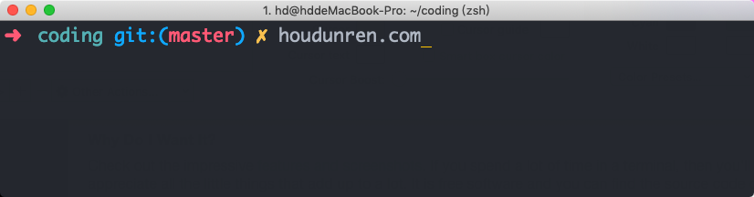
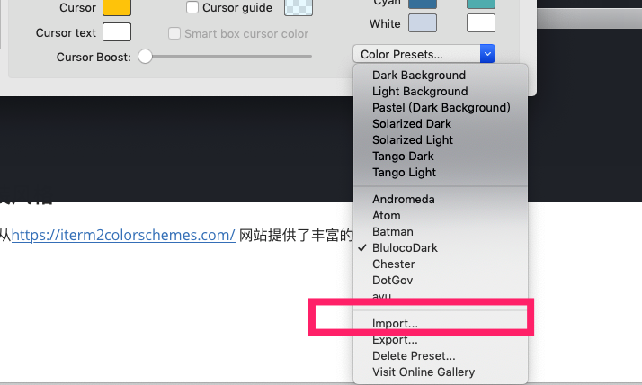

# item2

Iterm2 是苹果系统增加的命令行工具，定制化很强使用方便，并且外观也好看。

## 安装

直接从官网下载安装即可：https://iterm2colorschemes.com/

## 风格设定

我们可以定制非常漂亮的iterm风格，下面是向军大叔在使用的风格

### 安装风格

首先从https://iterm2colorschemes.com/ 网站提供了丰富的风格包以供下载。

解包后在iterm软件包中导入风格包

