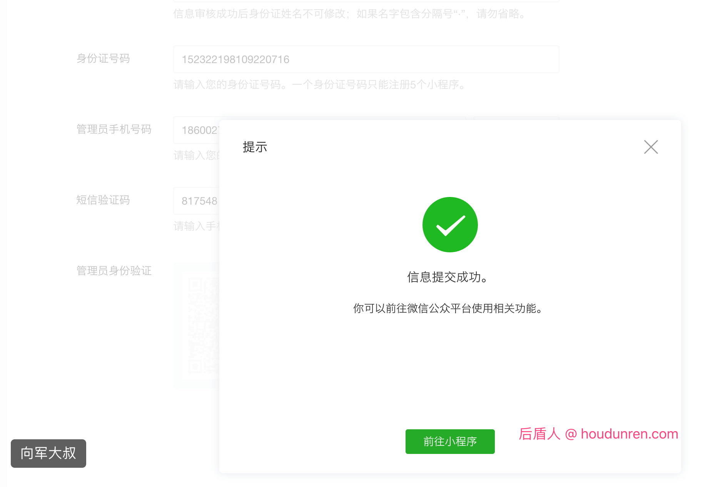
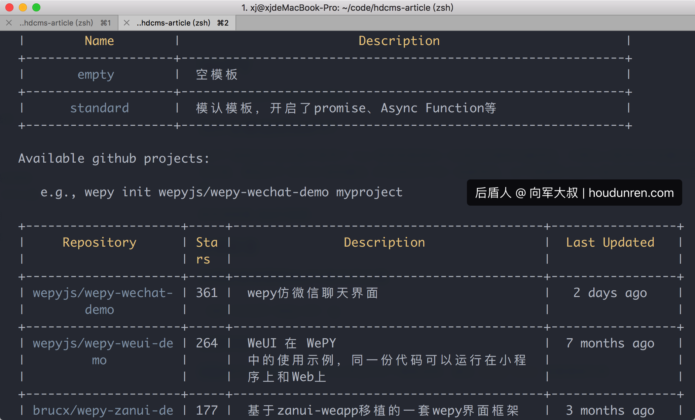

## 小程序

### 申请帐号

点击 <https://mp.weixin.qq.com/wxopen/waregister?action=step1> 根据指引填写信息和提交相应的资料，就可以拥有自己的小程序帐号。



注册后登录 https://mp.weixin.qq.com 来开始学习小程序开发。

### 测试帐号

为方便开发者开发和体验小程序、小游戏的各种能力，开发者可以申请小程序或小游戏的测试号，并使用此帐号在开发者工具创建项目进行开发测试，以及真机预览体验。

https://developers.weixin.qq.com/miniprogram/dev/devtools/sandbox.html

## 开发环境

### 文档手册

下面是小程序开发中用到的文档列表

官方文档：https://developers.weixin.qq.com/miniprogram/dev/

wepyjs：https://tencent.github.io/wepy/document.html#/

weui：https://github.com/wepyjs/wepy-weui-demo

### 调试工具

https://developers.weixin.qq.com/miniprogram/dev/devtools/download.html

### PHPSTORM

文件后缀为`.wpy`，可共用`Vue`的高亮规则，但需要手动设置。下面提供一些常见IDE或编辑器中实现代码高亮的相关设置步骤以供参考。

**WebStorm/PhpStorm**

1. 打开`Settings`，搜索`Plugins`，搜索`Vue.js`插件并安装。
2. 打开`Settings`，搜索`File Types`，找到`Vue.js Template`，在`Registered Patterns`添加`*.wpy`，即可高亮。

> 其他开发工具配置请查看官网文档

## WePY

WePY是高效的小程序开发框架。

### 为什么要选择WePY？

WePY 框架在开发过程中参考了 Vue 等现有框架的一些语法风格和功能特性，对原生小程序的开发模式进行了再次封装，更贴近于 MVVM 架构模式, 并支持ES6/7的一些新特性。以下是使用 WePY 前后的代码对比与组件化示例。

具体请查看 [WePY官网](https://tencent.github.io/wepy/index.html)

### 安装配置

全局安装或更新WePY命令行工具

```
npm install wepy-cli -g
```

**创建项目**

wepy提供了官网和基于GitHub项目的多个模板选择，通过 `wepy list` 查看模板列表



```
wepy init standard hdcms-article
```


**切换至项目目录**

```
cd hdcms-article
```

**安装依赖**

```
cnpm install
```

**开启实时编译**

```
wepy build --watch
```

## WEUI

下载为小程序开发的WEUI样式库 https://github.com/wepyjs/wepy-weui-demo

```
git clone git@github.com:wepyjs/wepy-weui-demo.git
```

复制到小程序项目

```
cp -r wepy-weui-demo/src/style hdcms-article/src/style
```

在 `src/app.wpy` 文件中引入样式文件

```
<style lang="less">
@import 'style/weui.less';
...
```

## 菜单栏

修改 `app.wpy` 文件内容如下，下面使用的字体是从 `http://www.iconfont.cn/` 下载的

```
tabBar: {
        list: [{
          pagePath: 'pages/index',
          text: '首页',
          iconPath: 'images/home.png',
          selectedIconPath: 'images/home-active.png'
	}, {
          pagePath: 'pages/category',
          text: '栏目',
          iconPath: 'images/category.png',
          selectedIconPath: 'images/category-active.png'
	}]
}
```

需要保证 `pathPath`中的页面已经在上面的 `pages` 选项中定义好。

## 幻灯片

```
<template>
    <swiper indicator-dots="true" autoplay="true" interval="3000">
        <repeat for="{{imgUrls}}" key="index" index="index" item="item">
            <swiper-item>
                <navigator url="/pages/article?id={{item.id}}" hover-class="navigator-hover">
                    <image src="{{item.thumb}}" class="slide-image" width="355" height="150"/>
                </navigator>
            </swiper-item>
        </repeat>
    </swiper>
</template>

<script>
  import wepy from 'wepy'

  export default class Index extends wepy.page {
    config = {
      navigationBarTitleText: '后盾人'
    }
    data = {
      imgUrls: [
        {id: 1, thumb: 'http://img02.tooopen.com/images/20150928/tooopen_sy_143912755726.jpg'},
        {id: 1, thumb: 'http://img06.tooopen.com/images/20160818/tooopen_sy_175866434296.jpg'},
        {id: 1, thumb: 'http://img06.tooopen.com/images/20160818/tooopen_sy_175833047715.jpg'}
      ]
    }
  }
</script>
```

**说明**

* 文档 https://developers.weixin.qq.com/miniprogram/dev/component/swiper.html
* 使用wepy就不能使用官方框架的 `wx:for` 而要使用 `repeat` 参考文档：https://tencent.github.io/wepy/document.html#/?id=%E7%BB%84%E4%BB%B6%E7%9A%84%E5%BE%AA%E7%8E%AF%E6%B8%B2%E6%9F%93

## 列表组件

```
<!--文章列表-->
    <view class="page__bd">
        <view class="weui-panel weui-panel_access">
            <view class="weui-panel__hd">最新文章</view>
            <view class="weui-panel__bd">
                <navigator url="/pages/article?id=1" class="weui-media-box weui-media-box_appmsg" hover-class="weui-cell_active">
                    <view class="weui-media-box__hd weui-media-box__hd_in-appmsg">
                        <image class="weui-media-box__thumb" src="http://www.houdunwang.com/attachment/2018/05/25/56711527242221.jpg"/>
                    </view>
                    <view class="weui-media-box__bd weui-media-box__bd_in-appmsg">
                        <view class="weui-media-box__title">标题一111222</view>
                        <view class="weui-media-box__desc">由各种物质组成的巨型球状天体，叫做星球。星球有一定的形状，有自己的运行轨道。</view>
                    </view>
                </navigator>
                <navigator url="" class="weui-media-box weui-media-box_appmsg" hover-class="weui-cell_active">
                    <view class="weui-media-box__hd weui-media-box__hd_in-appmsg">
                        <image class="weui-media-box__thumb" src="{{icon60}}"/>
                    </view>
                    <view class="weui-media-box__bd weui-media-box__bd_in-appmsg">
                        <view class="weui-media-box__title">标题二</view>
                        <view class="weui-media-box__desc">由各种物质组成的巨型球状天体，叫做星球。星球有一定的形状，有自己的运行轨道。</view>
                    </view>
                </navigator>
            </view>
        </view>
    </view>
```

上例中的 `<navigator url="/pages/article?id=1"`说明如下

navigator 标签用于定义导航使用 ，url参数指跳转地址，id为传递给article.wpy页面的参数。

## 获取参数

下面是当点击幻灯片时跳到到 `pages/article.wpy` 页面时获取参数

```
<script>
  import wepy from 'wepy'

  export default class Article extends wepy.page {
    onLoad = function (options) {
      console.log(options)
    }
  }
</script>
```

`options` 包含了包的参数列表

## 页面事件

https://developers.weixin.qq.com/miniprogram/dev/framework/app-service/page.html

下面列出几个常用的页面事件

* onLoad(Object query) 页面加载时触发。`一个页面只会调用一次`，可以在 onLoad 的参数中获取打开当前页面路径中的参数。
* onShow()页面显示/切入前台时触发。

## 自定义服务

### 请求接口服务

定义 `services/api.js` 文件内容如下：

```
import wepy from 'wepy'

const host = 'http://www.houdunren.com'
const util = {
  // 异步请求
  api: async (options) => {
    wepy.showLoading({title: '请求中..'})
    options.url = host + '/' + options.url
    let response = await wepy.request(options)
    // 上面的 await 请求成功后才会执行页面的代码
    setTimeout(function () {
      wepy.hideLoading()
    }, 3000)

    return response
  }
}
export default util

```

## 表单提交

下面是一个表单示例

```
<style lang="less">
    view.send {
        margin: 20px;
    }
</style>
<template>
    <form @submit="submit">
        <view class="form">
            <view class="weui-panel weui-panel_access">
                <view class="weui-panel__hd">会员登录</view>
                <view class="weui-panel__bd">
                    <view class="weui-cell weui-cell_input">
                        <view class="weui-cell__hd">
                            <view class="weui-label">邮箱</view>
                        </view>
                        <view class="weui-cell__bd">
                            <input class="weui-input" name="email"/>
                        </view>
                    </view>
                    <view class="weui-cell weui-cell_input">
                        <view class="weui-cell__hd">
                            <view class="weui-label">密码</view>
                        </view>
                        <view class="weui-cell__bd">
                            <input class="weui-input" name="password"/>
                        </view>
                    </view>

                </view>
            </view>
            <view class="page__bd page__bd_spacing send">
                <button class="weui-btn" type="primary" form-type="submit">登录</button>
            </view>
        </view>
    </form>
</template>

<script>
  import wepy from 'wepy'

  export default class Login extends wepy.page {
    methods = {
      submit(e) {
        #这里保存了表单数据
        let formData = e.detail.value
        if (!formData.email || !formData.password) {
          wepy.showToast({
            title: '邮箱或密码不能为空',
            icon: 'none',
            duration: 2000
          })
          return false
        }
      }
    }
  }
</script>
```

## async/await

用async/await来发送异步请求，从服务端获取数据，代码很简洁，同时async/await 已经被标准化。

首先在app.wpy中使API promise化开启 async/await功能。

```
export default class extends wepy.app {
	...
    constructor () {
        super();
        this.use('promisify');
    }
}
```

## 解析HTML

对HTML数据我们需要转化为小程序可识别的组件

### 安装 wxParse

```
git clone https://github.com/icindy/wxParse.git
```

复制目录到小程序项目的src目录中

```
cp -r wxParse/wxParse hdcms-article/src
```

### 配置

在 `app.wpy` 中引入

```
<style lang="less">
  @import "wxParse/wxParse.wxss";
```

具体页面中使用，下面我们在 `pages/article.wpy` 页面中的定义

```
<script>
  ...
  //  1） 引入 wxparse.js
  import WxParse from '@/wxParse/wxParse.js'

  export default class Article extends wepy.page {
    data = {
      field: {}
    }
    async onLoad(options) {
      let response = await article.getById(options.id)
      let field = response.data.data
      // 2） 将field.content 转化为小程序可识别内容并定义为content
      //     模板中就要使用content变量显示
      let that = this
      WxParse.wxParse('content', 'html', field.content, that, 5)
      this.field = field
      this.$apply()
    }
  }
</script>
```

模板中使用方法

```
<template>
  <!-- 1） 导入组件-->
  <import src="../wxParse/wxParse.wxml"/>
  <view class="title">{{field.title}}</view>
  <view class="content">
    <!-- 2） 展示数据-->
    <template is="wxParse" data="{{wxParseData:content.nodes}}"/>
  </view>
</template>
```

## 下拉刷新

下面是下拉刷新的操作方法

```
<script>
  import wepy from 'wepy'
  import article from '@/services/article'

  export default class Lists extends wepy.page {
    config = {
      // 1) 开启下拉刷新功能
      enablePullDownRefresh: true
    }
   ...
   	// 2) 下拉刷新获取数据
    async onPullDownRefresh() {
      this.page += 1
      await this.getArticles()
      // 停止当前页面下拉刷新
      wepy.stopPullDownRefresh()
    }
   }
```

## wx:if

当 wx:if 指令为真时显示组件

```
<form @submit="login" wx:if="{{!isLogin}}">
</form>
```

## Api

下面列出常用的小程序API，更多API使用请查看小程序官网。

[wx.request(OBJECT)](https://developers.weixin.qq.com/miniprogram/dev/api/network-request.html)

[wx.setStorageSync(KEY,DATA)](https://developers.weixin.qq.com/miniprogram/dev/api/data.html#wxsetstorageobject)

[wx.getStorageSync(KEY)](https://developers.weixin.qq.com/miniprogram/dev/api/data.html#wxgetstoragesynckey)

[wx.removeStorageSync(KEY)](https://developers.weixin.qq.com/miniprogram/dev/api/data.html#wxremovestoragesynckey)

[wx.showToast(OBJECT)](https://developers.weixin.qq.com/miniprogram/dev/api/api-react.html#wxshowtoastobject)

[wx.hideToast()](https://developers.weixin.qq.com/miniprogram/dev/api/api-react.html#wxhidetoast)

[wx.showLoading(OBJECT)](https://developers.weixin.qq.com/miniprogram/dev/api/api-react.html#wxshowloadingobject)

[wx.hideLoading()](https://developers.weixin.qq.com/miniprogram/dev/api/api-react.html#wxhideloading)

[Page.onPullDownRefresh()](https://developers.weixin.qq.com/miniprogram/dev/api/pulldown.html#pageonpulldownrefresh)

[wx.navigateTo(OBJECT)](https://developers.weixin.qq.com/miniprogram/dev/api/ui-navigate.html#wxnavigatetoobject)

[wx.redirectTo(OBJECT)](https://developers.weixin.qq.com/miniprogram/dev/api/ui-navigate.html#wxredirecttoobject)

[wx.navigateBack(OBJECT)](https://developers.weixin.qq.com/miniprogram/dev/api/ui-navigate.html#wxnavigatebackobject)

