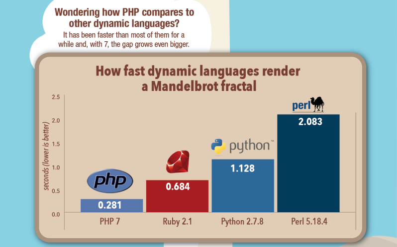
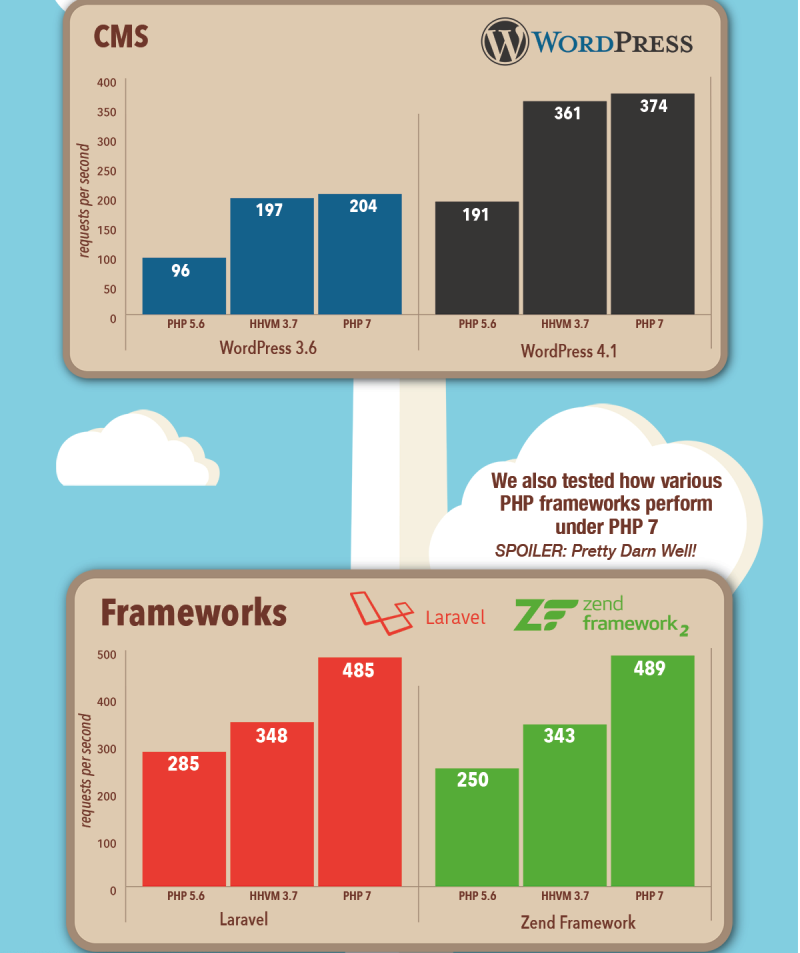

# 文档说明 

> 创作不易，转载请注明出处： 后盾人 @ houdurnen.com

为了让大家学习时更加方便，我们不只在 houdurnen.com 上提交视频教程，同时提供全套视频代码与文档等素材，下面是项目地址。

* http://gitee.com/houdunren/code
* http://github.com/houdunwang/coding

> 视频教程已经免费发布，看视频学习更生动 [houdunren.com](http://www.houdunren.com)

# 语言介绍

## 占有率高

PHP（外文名:PHP: Hypertext Preprocessor，中文名：“超文本预处理器”）是一种通用开源脚本语言。利于学习，使用广泛，主要适用于Web开发领域。。

截至 2018 年，近 80％ 的互联网网站基于 PHP 开发和运行，下图是[w3techs](https://w3techs.com)提供的PHP在[web开发市场占有率](https://w3techs.com/technologies/details/pl-php/all/all)。

PHP 在服务器脚本语言市场[占有率](https://w3techs.com/technologies/overview/programming_language/all)中遥遥领先于其他对手：

上图是 [W3Techs](https://w3techs.com/technologies/overview/programming_language/all) 提供的 [服务器端脚本语言市场占有率](https://w3techs.com/technologies/overview/programming_language/all) 排名，根据数据显示 [Alexa](http://www.alexa.com/) 世界排名 **前一千万** 的网站，有 82.6% 使用 PHP 构建，此数据每日更新。

通过数据可以知道PHP语言是热度和使用度非常高，大部分商业网站都在使用PHP进行开发，显而易见PHP人才需要量巨大，学习和使用PHP语言是很有前途的。

## 性能强悍

PHP最新版本是PHP7，在性能和功能上都是史无前例的提升，下图是[Zend](http://www.zend.com/en/resources/php7_infographic)官方给出的PHP与其他语言[性能比较](http://www.zend.com/en/resources/php7_infographic)（数值越小性能越高）。

我们再来看看PHP7与以往版本相比较的[性能提升](http://www.zend.com/en/resources/php7_infographic)（数值越大性能越高）。

下面是 [PHP与Pyton&Java&Perl等主流语言](https://blog.famzah.net/2016/02/09/cpp-vs-python-vs-perl-vs-php-performance-benchmark-2016/) 的性能比较（注：排名越靠前越好）

 从运行结果分析，PHP7.0 比Python 快3倍，比Java也高出2倍多的速度，比自家PHP 5.6快出10位多。

> 脚本语言中明显的赢家是…PHP 7。🙂

 

## 哪些网站在使用？

| 网站     | 地址                               |
| -------- | ---------------------------------- |
| 唯品会   | https://www.vip.com/index.php      |
| 百度     | https://www.baidu.com/index.php    |
| bilibili | https://www.bilibili.com/index.php |
| 链家网   | https://bj.lianjia.com/index.php   |
| Facebook | https://www.Facebook.com           |
