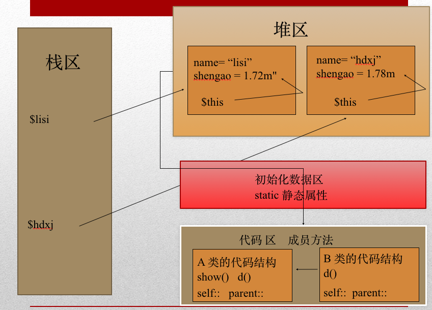

# 面向对象

## 历史

早期编程由于受电脑硬件限制，程序都是追求效率，而忽略可理解性，扩充性，随着硬件技术的发展，编程越来越重视多人开发，程序员越来越重视程序的可靠性，可扩展性，可维护性，所以刺激了程序语言的发展

面向过程

- - 程序员设计好程序代码流程图，辅助程序设计。优点：用什么功能就编写什么函数    缺点：数据管理上比较混乱 ，主要集中在函数成面上，面向对象把属性和方法进行封装，更好的可重用性和可扩展性

面向对象

- - 万物皆对象，将构成问题的事务分解到各个对象上，建立对象的目的不是为了完成一个工作，而是为了描述某个事务在解决问题中的行为，更符合人的思维习惯，代码重用性高，可扩展性好

面向对象和面向过程的核心区别是如何分配职责。

## 类

- - 是一种抽象的概念，是具有相同语义定义对象的集合（具有相同属性和方法的集体），使用具体的类是不可行的，只能实例化。拿汽车举例，汽车的设计图纸就是类，汽车是对象。设计中重点是类的创建

现实生活中类的概念

- - 万物皆为对象如我们使用的具体电脑就是对象，那电脑就是一个类。你去幼儿园接孩子，你说接孩子，人家一定不给你（除非认识你和知道你的孩子是谁），你要说出你孩子的名子，你的孩子就是具体的对象，孩子就是一个类

类名书写规范

- - 类名首字母大写
  - 一个类定义在一个文件中，并以.class.php做为文件名结尾

## 对象

对象句柄

- - 用于区分不同对象。对象创建后，在内存中获取一块存储空间，储存空间的地址就是对象的标识或句柄

属性

- - 在类中定义的变量，即为成员属性，用于描述对象静态特性的数据。如人的姓名，性别，首字母小写

方法

- - 函数定义在类中即为成员方法，用于描述对象动态特性的操作行为，方法名不区分大小写，不可重名，首字母小写

对象的生命周期

- - 创建后，生命周期开始，当程序结束后或程序员清除对象后即销毁，PHP会自动销毁对象

## 对象产生步骤

1. 在内容中开辟出对象的空间
2. 执行构造方法
3. 将对象的引用地址返回

## 对象的内存分布

1. 在内容中开辟出对象的空间
2. 执行构造方法
3. 将对象的引用地址返回
4. 对象引用被放到了“栈内存”里（栈存放固定内容）
5. 对象是放在“堆内存”里（堆存放可变内容）
6. 而静态成员则放到了“数据区”，在第一次被加载的时候放入的，可以让堆内存里面的每个对象所共享
7. 函数和方法放在代码区



## 对象的生命周期

1 程序执行完成后，PHP运行回收机制，删除内存的对象

2 删除所有对象的引用后，对象即为垃圾，回收机制自动删除垃圾

## 面向对象的特性

抽象性

- - 把一类对象的共有属性和方法抽象出来，形成类，这种思考方式为抽象

封装性：

- - 把成员方法和成员属性封装到类中，隐藏属性和方法，隐藏方法实现的细节，通过public protected private static  限定类成员的访问权限，数据被保护在内部，只有通过被授权的成员方法才可以操作。尽可能的对成员进行封装

继承extends：

- - 可以使一个类继承并拥有另一个已经存在类的成员属性和方法，被继承的类称为父类或基类，继承类为子类。extends 关键字 实现继承关系

## 封装

publlic 公有

- - 在类的内部与外部或子类都可以访问，是最开放的权限

private 私有的

- - 定义类的属性和方法，在类的内部可以访问，在类的外部或子类都不可以访问

protected 受保护的

- - 定义类的属性和方法，在类的内部或子类可以访问，类的外部不可以访问

模块设计

- - 强内聚（功能尽量在类的内部完成），弱耦合（开放尽量少的方法给外部调用）。例：公司销售接项目，具体工作交给公司内部程序员，设计人员，服务器管理人员协同完成

## static

static：

- - 需要一个数据对象只服务于类，即类内部可用，对外不可用时。建对象是极其耗费资源的,因此当一个方法具有比较强的公用性的时候,没有必要为了调用这个方法而重新再生成该类的实例。定义的方法或变量在程序第一次加载时即驻留内存，程序结束释放。
  - 静态方法不能被非静态方法重写，构造方法不允许声明为static的

static变量：

- - 通过static声明的成员变量为静态变量或叫类变量，是该类的公共变量，在第一次使用时即生成，对于该类的所有对象只有一份，是属于类的，不是属于对象的。static变量是属于类而不属于对象，可以在任何地方通地类来访问，是类的全局变量，类创建时即存入内存。对多个对象来说，静态数据成员只存储一处，可以节省内存。只要对静态数据成员的值更新一次，保证所有对象存取更新后的相同的值。

static方法：

- - 用static声明的方法为静态方法或叫类方法，执行该方法时不会将对象引用传给函数，所以我们不能访问非静态成员，只能访问静态方法或静态变量。只能使用关于类的方式如self   static  parent等。使用时不用生成对象即可执行

## $this self:: parent::

$this

- - 是当前对象的引用， 一般出现在方法里,用于获取类的成员属性，或执行类的成员方法

self::

- - 对本类的引用 ，用于获取当前类的表态成员属性或静态成员方法self::run()

parent::

- - 对父类的引用,调用父类的方法或属性。

## 构造方法&析构方法

构造方法__construct()

- - 在创建对象时自动执行，没有返回值，用于执行类的一些初始化工作，如对象属性的初始化工作，PHP4中构造方法必须与类同名，php5中规定构造方法为__construct(),优点是不受类名的影响，如果不存在__construct  php搜索与类同名的方法自动执行。
  - 可以在构造方法中传递参数，用于定义属性，在父类和子类都定义构造方法时，执行子类的构造方法

析构方法__destruct()：

- - 用于对象在内存中被销毁时自动执行的方法，不带任何参数

## 抽象类&抽象方法

具有抽象方法的类为抽象类，抽象方法即为没有内容的空方法，要求子类进行完善内容，抽象类不能实例化，只能继承，通过extends来实现，抽象类中也可以定义普通方法

父类方法执行方式不确定，但子类还都有这个方法

- - 例1：如交通工具类：定义抽象方法控制交通工具运行方式，这样每个交通工具如飞机，汽车都要重写父类方法。如果在父类工具类定义该方法（比如在地上走）没有任何意义，因为每个交通工具都要重写（飞机要重写方法，船要重写方法），所以针对你类方法的不确定性，我们需要抽象方法，实现多态。
  - 例2：定义动物类，每个动物都有叫声方法，但是表面不同，所以要定义为抽象类，让每种动物类去实现功能。

- 当父类为抽象类时，子类必须重写父类的抽象方法

- 抽象类里不一定非要写抽象方法，但有抽象方法的类必须定义为抽象类

- 抽象类必须继承使用

- 抽象方法不能有主体即{}

- ```
  <?php
  
  abstract class AbstractClass
  
  {
  
     // 强制要求子类定义这些方法
  
  ​    abstract protected function getValue();
  
  ​    abstract protected function prefixValue($prefix);
  
  
  
  ​    // 普通方法（非抽象方法）
  
  ​    public function printOut() {
  
  ​        print $this->getValue();
  
  ​    }
  
  }
  ```

## 接口

接口是一组成员声明方法的集合，包含空的成员方法和常量，空的方法要求继承类去具体实现。成员方法为public，属性为常量。

- - 例如：现实中的电脑USB或PCI插槽，插线板等都有接口例子

继承是一级一级层次式，如果某一层出现问题，整个继承就会出现意外。而接口只影响实现接口的类，接口可以在破坏原来的继承基础上对类扩展。接口可以实现多继承。 

- - 例：电脑USB接口，规定各个厂商必须构造合适的接口方法，比如手机，数码相机，网银U盾。要让各个厂商写自己的方法如U盾插到USB上他会自动安装网银驱盾，弹出网页，手机装上后可以打开手机里的内容，同时可以充电

抽象类及普通类都可以实现接口，通过关键字implements

接口与抽象类的区别：

- - 1 接口只能用implements实现   抽象类用extends继承实现
  - 2 接口没有数据成员，可以定义常量，抽象类可以有
  - 3 接口没有构造函数，抽象类可以定义构造函数
  - 4 接口方法都是public 抽象类方法可以用protected private public来修饰
  - 5 一个类可以实现多个接口，但只能继承一个抽象类
  - 6 接口中不可以有成员方法，抽象类可以有成员方法

```
interface DbInterface {
    public function connectDb(); //获得连接   参数为表名
    public function close(); //关闭数据库
    public function exe($sql); //发送没有返回值的sql
    public function query($sql); //有返回值的sql
｝
class Db implements DbInterface
{
	public function exe($sql){
	}
	public function query($sql{
	}
｝
```

