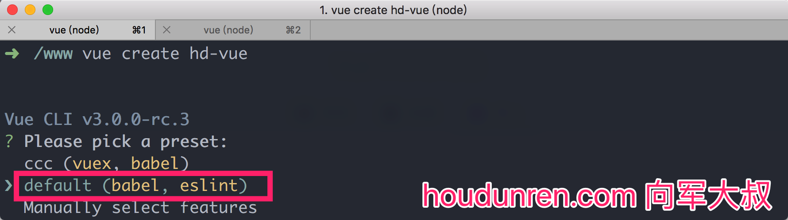

## VueJS

## 开发环境

#### NODE

安装NODE 8.1版本以上 https://nodejs.org/zh-cn/

#### 安装vue-cli

https://cli.vuejs.org/guide/creating-a-project.html#installation

```
npm install -g @vue/cli
```

## 创建项目

创建项目有两种方式 

#### 命令行

```
vue create hd-vue
```



下面命令行安装时的选项

1. default （babel，eslint）
2. Use NPM

#### GUI

命令行执行以下命令会调出图形设置界面

```
sudo vue ui
```

选择 `创建` 项目


> 使用图形界面创建与命令行无异，不详细赘述了


#### 运行

```
$ cd hd-vue
$ npm run serve
```

#### sass&less

项目开发中经常需要使用 sass 处理CSS样式，比如我们使用 bootstrap 时， 所以需要安装 sass编译环境。

```
# Sass
npm install -D sass-loader node-sass

# Less
npm install -D less-loader less

# Stylus
npm install -D stylus-loader stylus
```

引入 `bootstrap ` 和 `font-awesome`

下面是在 `script` 里引入

```
<script>
import HelloWorld from './components/HelloWorld.vue'
import 'bootstrap/dist/css/bootstrap.min.css';
import 'bootstrap/dist/js/bootstrap'
import 'font-awesome/css/font-awesome.min.css'
...
</script>
```

下面是在 `style`引入 `bootstrap` 样式

```
<style lang="scss">
  @import '~bootstrap/dist/css/bootstrap.min.css';
  @import '~font-awesome/css/font-awesome.min.css';
...
</style>
```

> ~ 可以理解为 `node_mobules`

## 插件开发

将组件或指令开发成插件可以方便的为其他项目使用，也可以放在GITHUB中为任何Vue项目使用。

#### 构建项目

```
vue init webpack-simple vue-form
```

> 我们的主要工作目录是 `src`

#### 插件入口文件

下面是src 的目录结构

```
├── App.vue
├── assets
│   └── logo.png
├── components
│   └── Image.vue #为插件开发的组件
├── index.js #插件入口
└── main.js
```

`index.js` 与 `comments/Image.vue` 是我们新添加的文件。

```
# index.js
import Image from './components/Image'

const components = [
  Image
];
const plugin = {
  install(Vue, options) {
    if (plugin.installed) return;
    components.map(component => Vue.component(component.name, component));
    Vue.mixin({
      mounted() {
        console.log('Mounted!');
      }
    })
  }
}
if (typeof window !== 'undefined' && window.Vue) {
  plugin(window.Vue)
}
export default plugin
```

```
# comments/Image.vue
<template>
    <div>
      <h1>image...</h1>
    </div>
</template>

<script>
    export default {
        name: "HdImage"
    }
</script>

<style scoped>

</style>
```

#### 插件调试

开发的插件可以安装在项目中，修改 `main.js` 文件如下

```
...
import Vue from 'vue'
import App from './App.vue'
// 引入插件
import Index from './index'
Vue.use(Index);
new Vue({
  el: '#app',
  render: h => h(App)
});
...
```

在项目目录下执行 `npm run dev` 开始在浏览器中查看结果，修改代码后页面会自动刷新。

#### 插件打包

修改项目目录下的 `webpack.config.js` 的部分内容

```
  module.exports = {
      //修改为插件入口文件
      entry: {
        'build':'./src/main.js',
        'vue-form':'./src/index.js'
      },
      output: {
        path: path.resolve(__dirname, './dist'),
        publicPath: '/dist/',
        //生成文件名
        filename: '[name].js',
        // library指定的就是你使用require时的模块名，这里便是require("PayKeyboard")
        library: 'VueForm',
        //libraryTarget会生成不同umd的代码,可以只是commonjs标准的，也可以是指amd标准的，也可以只是通过script标签引入的。
        libraryTarget: 'umd',
        // 会对 UMD 的构建过程中的 AMD 模块进行命名。否则就使用匿名的 define。
        umdNamedDefine: true
      },
      .
      .
      .
```

* entry 定义插件入口文件
* filename 定义生成插件的文件名

修改完配置文件后，在项目下执行 `npm run build` 命令后就生成了最终的插件编译文件了。

#### 发布插件

在`package.json` 文件中添加配置项

```
{
  "name": "houdunren-vue-form",
  "description": "A Vue.js project",
  "version": "1.0.1",
  "author": "houdunwang <2300071698@qq.com>",
  "license": "MIT",
  "main": "dist/vue-form.js",
  "keywords": [
    "vue",
    "houdunren",
    "bootstrap",
    "后盾向军",
    "后盾人"
  ],
  "repository": {
    "type": "git",
    "url": "git+https://github.com/houdunwang/vue-form"
  },
  "bugs": {
    "url": "https://github.com/houdunwang/vue-form/issues"
  },
  "homepage": "https://github.com/houdunwang/vue-form#readme",
  .
  .
  .
```

部分变量说明：

* main——使用 require 加载时的文件
* keywords——Npm网站显示的包关键字
* repository —— Git仓库
* bugs——Git issues 地址
* homepage——项目GIt主页

**发布**

* 首先在 https://www.npmjs.com/ 注册一个帐号
* 删除 `package.json` 文件中的 `"private": true` 行
* 执行 `npm publish` 发布
* 如果发布失败是因为 `package.json` 中的 `name` 已经被别人占用了需要换个包名
* 发布后其他用户就可以使用 `npm i houdunren-vue-form -S` 安装你的插件了
* 每次发布新版本时记得修改 `package.json` 里的版本号

**撤销**

发布的包也可从NPM上删除

```
npm unpublish houdunwang-vue-form --force
```


