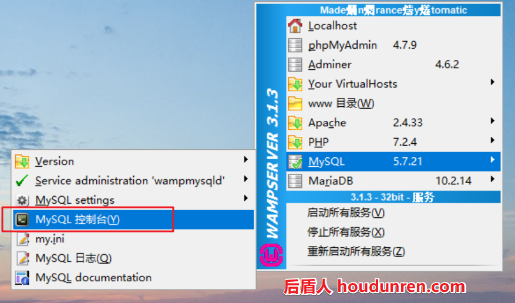
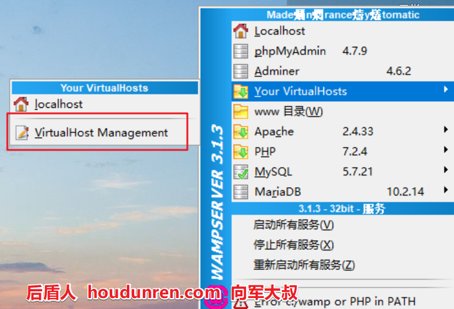
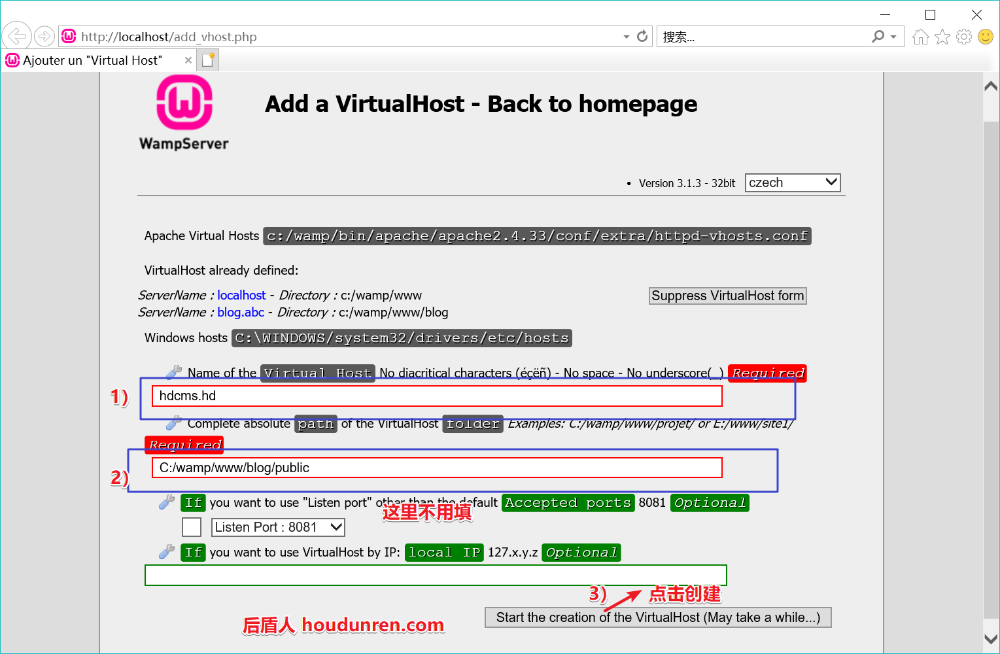
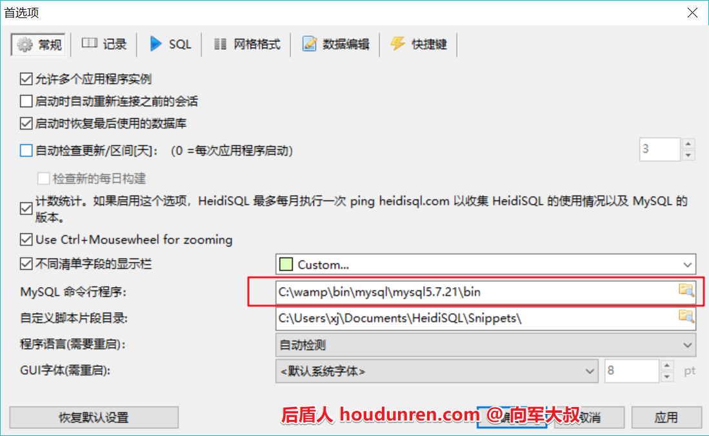

# wamp


> 后盾人 www.houdunren.com  作者：[向军大叔](http://www.aoxiangjun.com)

wamp是windows系统中老牌的也是优秀的集成化开发环境。

网站：http://www.wampserver.com/en/

如果下载慢我已经放在了百度网盘：https://pan.baidu.com/s/1ioh-UwiGb4whp67U36Un1w

#### 安装

1. 安装前先安装vc扩展：vcredist_arm.exe ,64位系统安装vcredist_x64.exe，32位操作系统安装 vcredist_x86.exe
2. 安装wamp应用程序

#### 目录

我将 `XAMPP` 安装在 `C:\wamp`

1. 站点目录 `C:\wamp\www `
2. PHP模块目录  `C:\wamp\bin\php\php7.2.4`
3. 虚拟主机配置文件 `C:\wamp\apache\conf\extra\httpd-vhosts.conf`

#### 环境变量

 将 `php.exe` 设置到系统环境变量中，Mac/Linux可以将php指令设置个软链接。

1. 右键点击 `我的电脑>属性`
2. 点击 `高级系统设置>环境变量`，在 `系统变量` 处选择 `Path` 选项，添加php命令所在目录 `C:\wamp\bin\php\php7.2.4` 

#### 修改Mysql密码

有时我们使用一些PHP的产品要求Mysql必须有密码，下面我们就来设置Mysql的密码。



mysql 5.7 密码字段由 `password` 改为　authentication_string


```
UPDATE mysql.user SET authentication_string=password('admin888') WHERE user='root';
flush privileges;
```

#### 虚拟主机

wamp可以非常简单的添加虚拟主机，并会自动修改 `C:\Windows\System32\drivers\etc\hosts` 文件，是windows系统中配置虚拟主要方便的。





使用 wamp 面板重新起动Apache，现在访问 hdcms.hd/ 就会访问到  `C:\wamp\www\blog\public` 目录（请先在public目录创建个 index.php文件为站点默认文件）

## HeidiSQL

HeidiSQL是一款用于简单化迷你的 MySQL 服务器和数据库管理的图形化界面适用于 windows 操作系统。 

#### 安装

登录官网下载 `https://www.heidisql.com/download.php`

**配置mysql命令**



## sequelpro

sequelpro 是专为 Mac用户准备的免费 Mysql管理软件。

下载 https://sequelpro.com/download

> 各软件都是图形界面，功能使用都直观简单，所以就进行介绍了。

## Laravel

如果你是在版本低于 5.7.7 的 MySQL release 上创建索引，那就需要你手动配置迁移生成的默认字符串长度。

在 AppServiceProvider.php 文件里的 boot 方法里设置 

```
public function boot()
{
 	\Schema::defaultStringLength(191);
}
```

