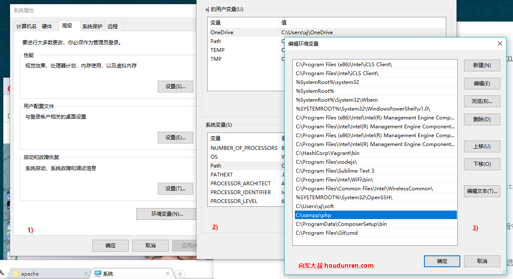
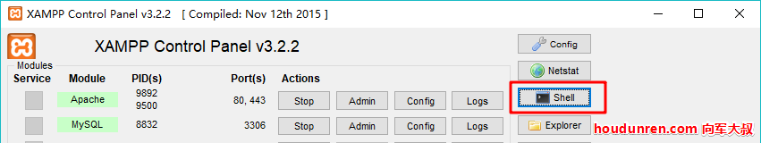
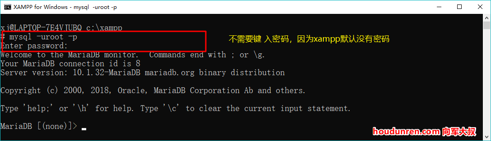
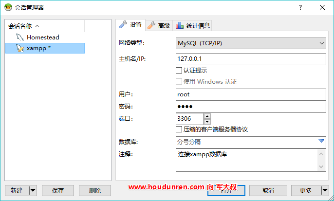

# Xampp与HeidiSQL


> 后盾人 www.houdunren.com  作者：[向军大叔](http://www.aoxiangjun.com)

## Xampp

XAMPP（Apache+MySQL+PHP+PERL）是一个功能强大的建站集成软件包。它可以在Windows、[Linux](https://baike.baidu.com/item/Linux)、Solaris、Mac OS X 等多种操作系统下安装使用。

#### 安装

1. 登录官网下载： https://www.apachefriends.org/zh_cn/index.html
2. 直载后一直下一步完成安装

#### 目录

我将 `XAMPP` 安装在 `C:\xampp`

1. 站点目录 `C:\xampp\htdocs `
2. PHP模块目录  `C:\xampp\php`
3. 虚拟主机配置文件 `C:\xampp\apache\conf\extra\httpd-vhosts.conf`

#### 环境变量

 将 `php.exe` 设置到系统环境变量中，Mac/Linux可以将php指令设置个软链接。

1. 右键点击 `我的电脑>属性`
2. 点击 `高级系统设置>环境变量`，在 `系统变量` 处选择 `Path` 选项，添加php命令所在目录 `C:\xampp\php` 

**修改Mysql密码**

xampp 默认密码为空，有时我们使用一些PHP的产品要求Mysql必须有密码，下面我们就来设置Mysql的密码。

1. 使用 xampp 面板打开命令行连接mysql
    

2. 修改密码

   ```
   UPDATE mysql.user SET password=password('admin888') WHERE user='root';
   flush privileges;
   ```

#### 虚拟主机

**配置hosts文件**

将域名 `hdcms.hd` 指定到站点目录 `C:\xampp\htdocs\hdcms`

打开虚拟主机配置文件 `C:\xampp\apache\conf\extra\httpd-vhosts.conf`，并添加虚拟主机配置

```
<VirtualHost *:80>
    DocumentRoot "C:/xampp/htdocs/hdcms"
    ServerName hdcms.hd
</VirtualHost>
#配置了虚拟主机后，需要为 http://localhost 域名也设置虚拟主机
<VirtualHost *:80>
    DocumentRoot "C:/xampp/htdocs"
    ServerName localhost
</VirtualHost>
```

**修改系统hosts文件**

hosts文件用来设置本地域名解析

1. 移动 `C:\Windows\System32\drivers\etc\hosts` 到桌面
2. 在文件末尾添加 `127.0.0.1 hdcms.hd`

使用 xampp 面板重新起动Apache，现在访问 hdcms.hd/ 就会访问到  `C:\xampp\htdocs\hdcms` 目录（请先创建个 index.php文件为站点默认文件）

#### 设置系统服务

1. 将Apache和Mysql设置为系统服务后可以做到开机自动启动。
2. 设置为系统服务 

## HeidiSQL

HeidiSQL是一款用于简单化迷你的 MySQL 服务器和数据库管理的图形化界面适用于 windows 操作系统。 

#### 安装

登录官网下载 `https://www.heidisql.com/download.php`



## sequelpro

sequelpro 是专为 Mac用户准备的免费 Mysql管理软件。

下载 https://sequelpro.com/download

> 各软件都是图形界面，功能使用都直观简单，所以就进行介绍了。

## Laravel

如果你是在版本低于 5.7.7 的 MySQL release 上创建索引，那就需要你手动配置迁移生成的默认字符串长度。

在 AppServiceProvider.php 文件里的 boot 方法里设置 

    public function boot()
    {
     	\Schema::defaultStringLength(191);
    }
